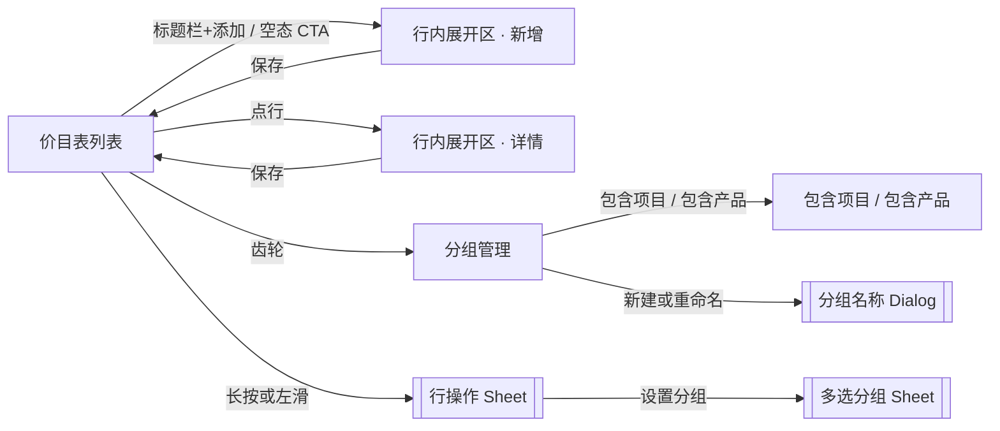

# PRD：项目创建与管理（价目表 · 商户端）

| 字段 | 内容 |
|------|------|
| 文档版本 | v1.33 |
| 日期 | 2026-09-24 |
| 交互原型（唯一可视依据） | 同目录 `index.html`（价目表独立原型，390 × 844；深链清单见 `README.md`）；**线上预览 <https://xdean-designer.github.io/menu/>**（GitHub Pages，`main` 分支根目录）；大原型镜像 `../card/demo.html`（中文镜像：`剑琅联盟-RTB重构.html`；功能链路「项目创建与管理」） |
| 画布 | 390 × 844 |
| 目的 | 供前端 / 后端 / 测试及 AI 工具落地「价目表（项目·产品）」；**只需本文 + 交互原型** |
| 关联（非必读） | 同目录 `PRD-会员卡管理.md`（办卡权益选品依赖本文价目数据；会员卡流程以该文档为准）；**`PRD-迁移方案-大类转主分组.md`（本模块替换线上价目时的数据迁移与提成口径方案，上线前**必读**）** |

---

## 修订记录

| 版本 | 日期 | 内容 |
|------|------|------|
| v1.33 | 2026-09-24 | **补产品维度的「分组管理·行展开」演示节点与 Figma 帧（原型仅新增一条深链，无功能与视觉变更）**。**① 背景**：既有演示节点 `price-group-menu`（行展开态）**只在项目维度**，产品维度缺失 —— 左侧导航「分组行展开」、Figma 第 18 帧均只有项目版。**② 新增节点 `price-group-menu-product`**：与 `price-group-menu` **完全对称**，仅把桶从 `project` 换成 `product` —— 先 `state.priceCatalogTab = 'product'` + `syncPriceCatalogTabs()`（入口文案与计数随之变 **「包含产品 / 个产品」**、分组数据取 `seedCatalogGroups().product`），再 `openCatalogGroupManage()`，最后显式展开**首个自定义产品组「洗护」**（`state.catalogGroupExpandedId = g.id`）。**进页默认仍收起**，仅该深链显式展开 —— 与 v1.20「进页一律收起」不冲突。**③ 左侧导航新增「分组行展开 · 产品」**（`_build-index.js` 的 `navSheets` → 重新生成 `index.html`）。**④ Figma「价目表-开发🔥」补第 19 帧** `价目表-19 分组管理·行展开（产品）`：原 `价目表-18 分组管理·行展开` 补 **「（项目）」**后缀、与 `05 分组管理（项目）` / `06 分组管理（产品）` 的命名口径对齐；新帧**紧接 18 之后**插入，其后 10 帧（原 19–28）**顺移为 20–29** 并整体重排 x。**⑤ 验证**：`_tmp_verify_groupmenu_prod.mjs` **14 PASS / 0 FAIL**（含「产品维度落「包含产品」且不含「包含项目」」「有且仅有一行展开（手风琴）」「系统『隐藏』组不可拖拽」「项目版 18 未受影响」等；均为实测断言）。改动同步 §4（深链清单）/ §6.4（深链补充说明）。 |
| v1.32 | 2026-09-24 | **修掉分组操作「写副本」缺陷（同一根因 4 处）：删除 / 新建 / 拖拽排序对分组数据的写入全部落空，且 toast 谎报成功**。**① 根因**：`getActiveCatalogGroups()` 每次调用都**新建一个数组**（`groups.filter(g => !g.system)` 之后再包一层 `[...custom, sys]`），它只是**渲染用的只读视图**；而四处**结构写操作**误把它当成数据本体 —— `confirmCatalogGroupDelete` 的 `splice`、`commitCatalogGroupName` 新建分支的 `push`、`commitCatalogGroupOrderFromDom` 的顺序回写 `splice`、`moveCatalogGroup` 的槽位交换，全部作用在副本上，`state.catalogGroups[bucket]` **从未被改动**；副本一被丢弃改动即消失，于是表现为「弹窗关掉了、toast 报了成功，界面却什么都没变」。**② 三个用户可见症状**：**删组**（本次上报）—— 确认后被删组**仍留在分组管理列表与分组轨上**（实测删除前 9 组 → 删除后仍 9 组，「洗吹」未消失）；**新建** —— toast「已新建分组」但列表 / 分组轨 / 「设置分组」Sheet 里**都不出现新组**；**拖拽排序** —— 松手后顺序**回弹**（顺序只是 DOM 呈现，重渲染即按 state 恢复）。**`moveCatalogGroup` 当前无调用方（死代码），同根因一并修正**。**③ 修法（只改写入端，视图语义与展示顺序不变）**：四处结构写操作一律改落到 **`getCatalogGroupsForBucket()`** 返回的**活数组**（即 `state.catalogGroups[bucket]` 本身）；删除时若 `state.catalogGroupExpandedId` 指向被删组则一并清空（避免留悬空展开态）。`getActiveCatalogGroups()` **继续只作只读** —— 供渲染、重名校验，以及「上 / 下移」按**视觉邻居**定位真实槽位（`indexOf`）之用；`moveCatalogGroup` 因「视觉顺序 = 自定义组… + 系统组」而改用 `indexOf` 映射，不再假设两者下标相同。**④ 行为定稿**：删除确认后该组**立即**从分组管理列表与分组轨消失，**组内条目本身不受影响**（实测成员 `p1,p3,p19` 均仍在价目表）；若删的正是当前筛选组，**筛选回落「全部」**；系统「隐藏」组**仍不可删、不可改名、仍固定末尾**；新建后**立即**出现在列表 / 分组轨 / Sheet（在空态 Sheet 走「去新建分组」时回填并**默认勾选**新组，仍须 Sheet「确定」才写入成员）；拖拽顺序**落库并跨重渲染保持**。**⑤ 验证**：`_tmp_verify_groupcrud.mjs` **29 PASS / 0 FAIL**（全程真实点击 / 真实指针拖拽驱动，并对 `window.state` 做独立断言；覆盖项目 / 产品两个 Tab 的删组、系统组拦截、删除后重渲染持久、新建后回填勾选、拖拽持久等）。改动同步 §6.4 / §6.6 / §7.3 / §10.2（+84～86）。 |
| v1.31 | 2026-09-24 | **四处视觉调整：选中态红改橙 + 展开区右侧数值收敛为单档黑 + 保存按钮改浅底（tinted）+ 保存图标换线描「存入托盘」**。**① 选中态改橙（新增色 `--brand-orange: #FF7A45`）**：主 Tab（项目 / 产品）选中文字与指示条、分组胶囊选中文字，四处声明由 `var(--brand)`（`#F32F41`）改 `var(--brand-orange)`。**严格最小范围** —— 其余红一律不动：标题栏「+添加」文字链、虚线添加行、空态 CTA、分组管理「新建分组」、「已绑卡」行名 `#333333`、必填星号、排序箭头、`switch.on`、勾选框、弹窗「确定/删除」、左滑删除底，**均仍为品牌红 `#F32F41`**（实测已断言）。分组胶囊选中仍为**白底**，只换字色。**② 展开区右侧数值改主文字档 `#1A1A1A`，时长控件除外**：`#fProjName`（原 `#929292` 灰）与 `#fPrice`（原 `#FE8D4B` 橙）统一为 `#1A1A1A`，与同区标签 / 时长数字框 / 规格输入框**同档**，同屏只有一档黑；字重仍 Medium(500)、仍右对齐。**这是产品决定，明确偏离 Figma 人工稿 `1258:616 / 1258:624`（该稿指定「灰字 + 品牌橙」）**，非实现偏差。时长控件（数字框 `#1A1A1A` / 未选单位 `#929292` / 选中单位 `#FF8A4C` / 滑块底 `#FE8B4B@10%`）**保持原样**。**③ 折叠行**：价格 `.price-num` 由主红 `#F32F41` 改 `#1A1A1A`（红色让位给「选中态」）；名称 `.name-text` 由「继承初始黑 `#000`」显式锁到 `#1A1A1A`，与同行价格同档。**两个语义例外用 `:not()` 排除、原声明不动**：`.is-bound` 绑卡名 `#333333`、`.is-off-sale` 下架名/价格 `#929292`。**④ 展开态标题行项目名转灰 `#929292`**：名称已在展开区字段里以可编辑值呈现，标题行降级为「这是哪一行」的定位线索，避免同屏两个等重黑体项目名；仅作用于 `.has-inline-panel`，折叠行不受影响。**⑤ 保存按钮改 tinted**：底由实心 `#F32F41` 改 **`--brand-soft` `#FFF2F2`**、字由白改 **品牌红 `#F32F41`**、按下 `#FEEAEC`；**满宽 / 高 48 / 圆角 12 / 页脚发丝线一概不变**（只降对比度、不减触摸区）。存盘图标由强制 `#fff` 改 **`currentColor`** 随之转红（**图形本身在 ⑥ 换稿**）。**弹窗「确定 / 删除」仍实心品牌红不动**（强打断场景，实心红是合理的）。**⑥ 保存图标换稿：实心软盘 → 线描「存入托盘」（arrow → line）**。**换稿三依据**：① 本模块 **19 个图标里 17 个是线描**（Stratis 族），实心软盘是其中**唯一的普通控件类实心图标**（另一个实心是左滑「删除」上的**锁角标**，徽标类实心合理）；② 原图标 13.5px 框里塞 **3 段子路径**（外框 + 快门 + 标签块），16px 下过密，还要靠 `stroke-width="0.2"` 反向补线；③ 按钮转 tinted 淡底后，那块实心红方块**成了按钮上最重的东西**，比 16px 的「保存」二字更抢眼。**新图标规格**：3 段线（箭杆 `M12 3.4v11.2` / 箭头 `M6.6 9.6l5.4 5.4 5.4-5.4` / 底线 `M3.4 21h17.2`）、`viewBox 0 0 24 24`、`stroke-width 2.3`、**圆头圆角收笔** —— **渲染 16px 时有效线宽 1.53px，与图标族 1.56px 同档**；墨迹 **13.0 × 13.27px**（≈ 原软盘 13.5px，**换图标不改变视觉重量**）；墨迹在 16px 框内水平居中 8.0 / 垂直 8.13（偏差 ≤0.3px），与文字的盒中心 y 偏差 ≤0.6px。**⚠️ 一并删除的 CSS**：`base.css` 里 `.catalog-inline-save__icon path { fill: currentColor; stroke: currentColor }` 是**为实心图标写的**，留着会把线描图形**整体填实**，已删除；`fill` / `stroke` / `stroke-width` 一律由 SVG 自带属性给出，与 `PROJ_CHEV_ICON` / `CATALOG_DUR_CLOCK_ICON` 等其余线描图标同口径。**按钮尺寸 / tinted 配色 / 与文字 gap 6 一概不变**。**⑦ 验证**：`_tmp_verify_v131.mjs` **28 PASS / 0 FAIL**（含「未波及项仍为 `#F32F41`」的反向断言）；换图标项另有专项 `_tmp_verify_saveicon.mjs` **18 PASS / 0 FAIL**（含「落到 DOM 里仍是线描、`fill` 为 `none`、未被填实」的断言）；全量回归 `_tmp_verify_catalog.mjs` **100 PASS / 0 FAIL**、`_tmp_verify_hidden_toggle.mjs` parity 六项全 `true`。改动同步 §6.1（主 Tab 规格 / 分组轨 / 行）/ §6.1.1（字段区视觉规范 / 页脚 / 保存按钮）/ §6.2 / §6.3 / §10.2（验收 47 / 53 / 55 改写，+80～83）。 |
| v1.30 | 2026-09-23 | **「已隐藏」折叠条改为「已下架」同款版式（仅底色与文字色保留差异）+ 修掉两分区交界处叠线**（承接 v1.29 的分区标题改造）。**① 版式统一**：`.catalog-hidden-toggle` 原为 `space-between`、`min-height:37px`、`padding:8px 12px`、`15px/400`、眼睛图标在左 + 折叠箭头在右；现与 `.catalog-offsale-head` 完全同款 —— **同宽 388 / 同高 26（写死 `height`+`min/max-height`）/ 13px / 400 / `justify-content:center` / `padding:0 16px` / `line-height:18px`**，实测 parity `heightSame / fontSizeSame / weightSame / centerSame / padSame` **全为真**。**② 只保留两处刻意差异**：底色 `#EEEEEE`（vs `#fff`）与文字色 `--text` `#333333`（vs `--text-sec` `#929292`）＝「同款但文字颜色区分」；块底 `#EEEEEE` 维持 v1.19 规则不变（实测 `hiddenBlockBg` 仍为 `rgb(238,238,238)`）。**③ 移除眼睛图标、保留折叠箭头**：删掉 label 内的 `${CATALOG_HIDE_ICON}`（**常量本身保留**，仍供「隐藏」Tab 使用，实测该 Tab `hasIco:true` 未受影响）；箭头作为唯一「可展开」线索保留，并由 `stroke="#929292"` 改 **`stroke="currentColor"`**（随文字色 → `#333`，非文字对比度 2.59:1 → **10.6:1**，越过 WCAG 3:1 建议线），尺寸 16→**14px**（按 v1.22「图标/文字 ≈ 1.07」比例折算）；实测 `14×14` / `color: rgb(51,51,51)` / `stroke="currentColor"`。**④ 热区取舍**：触控高度 **26px**（全宽 388）。**放弃伪元素外扩至 44px** —— 实测上方 **1px** 即为「已下架」区块内的可点行（`ROW:接发`）、下方 **12px** 后即为底部「添加项目」行，外扩会直接抢相邻元素点击，而 26＋12＝38px 仍不足 44。**⑤ 修掉交界处叠线（真 bug）**：`#projProjectTable .table-row-swipe:has(+ .catalog-hidden-block) .table-row::after` 原为 `display:block`，而 `.catalog-hidden-block::before` 在 `top:0` **无条件**画线 —— 当**有隐藏、无已下架**时二者落在**同一 y**、叠成一条比其它发丝线更重的线（已用左滑「上架」把演示数据构造成该状态复现：`matchedByHasRule:['卸甲重做']`、该行 `::after` 曾被设为 `block`）。现改为 **`display:none`**，该线由隐藏块自己提供 —— 与 §6.1.1 对「已下架」的处理对称。实测三态 `lineDrawers` 均为**单条**：有已下架 `['HIDDEN_BLOCK::before']`、**无已下架同样 `['HIDDEN_BLOCK::before']`**、展开态同样 1 条。**⑥ 验证**：全量回归 `_tmp_verify_catalog.mjs` **100 PASS / 0 FAIL**；`_tmp_verify_hidden_toggle.mjs` 已同步改写检查项（由「查眼睛图标」改为「查箭头 + 与已下架几何 parity」）。改动同步 §6.1（列表结构第 3 项）/ §6.1.1（分区标题与分区线）/ §10.2（验收 24 改写）。 |
| v1.29 | 2026-09-23 | **评审反馈落地：分区标题补副标题 + 分区线方向统一**（承接同事对原型的 5 条意见，仅第 2 条部分采纳，其余判定驳回/维持，理由见下）。**① 分区标题补足区分度**：`已下架` / `已隐藏` 两个分区标题原只有 4 字 / 3 字，评审者第一眼即误读为同一事物（原话「都是已下架的意思」），故补副标题点出业务差异 —— **`已下架 · 停售`**（`catalog.js` L2420）/ **`已隐藏 · 仅顾客端不可见`**（L2433）。**「仅」字是关键**：下架同样是「顾客端不可见」，若无「仅」则副标题反而无法与「已下架」区分（下架＝顾客端不可见 **且** 开单 / 权益选品均不可选；隐藏＝**仅**顾客端不可见、**开单仍可选**）—— 这也说明该混淆是**语义**问题而非样式问题：实测两标题本就不同规格（`已下架` 13px/400/`--text-sec`/居中；`已隐藏` 15px/400/`--text`/左对齐 + 折叠箭头）。**② 分区线方向统一（反向是评审「感觉被分隔符全部分开了」的真实成因）**：`.catalog-offsale-head` 的分区线画在**自己下方**（`background-position: 16px 100%`），而 `.catalog-hidden-block::before` 画在**自己上方**（`top: 0`）—— 两处方向相反，导致「已下架」标题被两条线**夹住**（上＝在售末行 `.table-row::after`、下＝自己的线），再加「已隐藏」上方那条，同一处 **78px 竖向区间内出现 3 条线**。现将 `.catalog-offsale-head` 改为 **`background-position: 16px 0`**（线移到自己上方），并把**早已存在却因特异性不足而失效**的「在售末行让位」规则复活 —— 原规则 `.table-row-swipe:has(+ .catalog-offsale-block) .table-row::after{display:none}` 无 ID 前缀，被 `#projProjectTable .table-row-swipe .table-row::after{display:block}` 覆盖（v1.28 已记为死代码），现补 ID 前缀；两处线同 y、同内缩（16/16），若同时绘制会叠成 1px 重线，故必须让位。修正后层级为：**在售末行无线 → 「已下架 · 停售」上方 1 条 → 「已隐藏 · 仅顾客端不可见」上方 1 条**，两个分区的线与方向完全一致。**③ 其余 4 条判定（均不采纳 / 维持现状）**：时长 `分 / 时` 双单位**保留**（服务时长跨度 5 分～8 小时，单用「分」需输 `480`、单用「时」需输 `0.75`，双单位是**防单位错误**而非多给一个选择；且控件是"数值 + 单位"同一字段，成本仅一次点选）；两个添加入口**保留**（列表 27 行而可视区仅 9 行，标题栏「+添加」保证**任意滚动位置都可达**，底部虚线行对应「内容末尾就近」并承担「列表到此结束、可继续添加」语义，两个空态/长列表场景各有覆盖；三入口共用同一提交流程且**已明确取消右下悬浮球**，故非冗余）；展开态行内隐藏时长 / 价格**保留**（数据就在同屏展开区表单里，非信息丢失；PRD 原意即「避免与展开区字段重复」，改回会出现同屏两处价格）；绑卡行无可见标识**维持现状**（现实中绝大多数项目终将绑卡，为**常态**加标识＝无信息量；原型中未渲染的 `.bound-tag` 死 CSS 留待后续清理，本次不动）。**④ 改动性质：仅文案 + 一处 CSS 数值，无逻辑变更** —— 全量回归 `_tmp_verify_catalog.mjs` **100 PASS / 0 FAIL**，`_tmp_verify_hidden_toggle.mjs` / `_tmp_verify_final.mjs` 均通过；新文案实测**不换行、不溢出**（分区头 `h=26` 未变、折叠条 `h=39` 未变、标签宽 189.1 < 可用宽，项目 Tab / 产品 Tab / 折叠展开态三种情形一致）。改动同步 §1.3 / §2（结构树）/ §6.1（列表结构）/ §6.1.1（分区标题与分区线规范）/ §10.2（验收 24 改写）。**⑤ 其余章节仍以短名「已下架」/「已隐藏」指代该分区**（属结构性称谓，如 §5 状态表、§6.1 拖拽拦截、§10.2 其它条目），**显示文案一律以 §6.1.1 为准**，不要按短名改回 UI。 |
| v1.28 | 2026-09-23 | **对照原型实测校正 7 处 + 发丝线等距修正**（本次不改原型逻辑，仅 ① 一处 CSS 数值修正，其余均为 PRD 与实测对齐）。**① 发丝线左右等距**：`.table-row::after`（`base.css` L1421）与 `.catalog-hidden-block::before`（L1327）原为 `left:16px / right:13px`，与 §6.1.1「行分隔线**左右各内缩 16**」**不符**；全仓 10 处发丝线中仅此 2 处为 13px，已统一为 **`right: 16px`**。**② 展开区高度按实测校正**：「约 308」→ **详情态 312**（§6.1.1 规格表 + 验收 56）；高度预算里「新增 638→312 / 新增产品 563→312」→ **均为 352**（＝312 ＋ v1.20 新增态题头 40；实测 `?flow=price-add` 与产品 Tab 新增态**结构完全一致**，均为 `head 40 + body 240 + foot 72`）。**③ 修正 `#catalogInlineHead` 过时描述**：v1.15 起「不再有」仅对**详情态**成立，**v1.20 起新增态题头回归并复用该 id**（40px）。**④ 删除「时长至少 5 分钟」规则**：`openDurPicker`（`catalog.js` L2148）**全仓无任何调用方**，`#durPickerMask` 为死 UI，该下限只存在于不可达的 `confirmDurPicker`（L2163）—— 删除 §5.2 校验行与 §9.1 toast 清单该句，§5.1 改述为「**无独立选择器入口**、校验仅未填/为 0」，验收 22 改写为「未填或为 0 → 请填写项目时长」。**⑤ 清理「未上传，不影响保存」残留**：§5.1 封面行与 §9.1 Dialog/Sheet 清单仍写该旧文案，与 §6.1.1「v1.16 起已删」**自相矛盾**（`catalog.js` 无此串），已删除。**⑥ 补 §7.1 `boundTemplateId` 字段**：单模板引用 ＝ `boundTemplateIds[0]`，`boundToCard` 由其派生（原型已有 `boundTemplateIds / Names`，缺单数项）。**⑦ 修正 v1.26 / v1.27 修订条笔误**：「验收 M1–M16」→ **M1–M22**（迁移方案已扩至 M22）；「`invalidateCommLineCache()` 全仓调用 30 余处」→ **17 处**（实测 `employee.js` 16 / `comm2.js` 1）；帮助弹窗「L478」→ **L477**。 |
| v1.27 | 2026-09-23 | **分组变更对提成的影响：不弹窗、自动生效、仅 toast；并统一「类 → 组」术语**（承接 v1.26 的迁移口径，仍属"替换线上"范畴、原型本期不改码）。**① 生效口径改为 `forward` 单一结果**：原「复用两枚按钮（本期全部重算 / 从现在起用新方案）」作废 —— 分组归属变更（成员增删 / 删组 / 改主分组）**即时生效、无弹窗、无二选一**，分界时刻**之后**按新分组算、**之前**按旧分组算（**按单据日期，非"按期"**）。**② 必须落「分界记录」**：薪资侧 `employee.js` 是**重算**（`finalizeSeedCommLines()` → `calcStaffTrial(staffId, trialPayload, state.salaryMonth)`）而非读存量，且 `invalidateCommLineCache()` 在代码里共 **17 处**调用（`employee.js` 16 / `comm2.js` 1） —— 只加 toast 不落分界会导致**当期金额被静默重算**、文案失真。实现复用方案侧既有 `_prev` 模式：分组加 `_prevItemIds` + `effectiveAt`，`lineInGroup()` 按 `line.ymd`（**已在试算载荷里**）取值，**零新增 UI**。**③ toast 文案定稿**：成员 / 主分组变更 → `分组已更新 · 之后的提成按新分组计算`；删组 → `「X」已删除 · N 条提成规则不再生效`；**仅当该分组被 ≥1 条提成规则引用时才弹**，重命名 / 新建 / 未被引用的分组改动**完全静默**。**④ 与方案侧重算弹窗互不干扰**：方案规则（`defaults` / `overrides` 等）改动**仍走**既有 `#comm2RecalcMask` 两枚按钮，本次不动；两条链各按行日期解析后叠加。**⑤ 术语统一（D9，范围已收窄）**：**仅**针对「通过价目表编辑的项目 / 产品」及「价目表功能所产生的分类 / 分组行为」这一条轴，**不涉及其他任何含义的「类」**—— 大类 → **主分组**、项目分类/产品分类 → **项目组/产品组**、整类 → **整组**（`提成设置/comm2.js` L1176 / L1181 / L2600）；**排除**（属别的轴，一处不得误改）：`#comm2CatSheetTitle` 的「分类提成」（L425）、帮助弹窗的「大类 / 大类卡」（`index.html` L471 / L481 / L574 —— 由同弹窗 L470「每张卡管一类业务」与 L477「这单属于哪一类」自证为**业务类型轴**）、支出管理「分类管理」；字段名 / 接口键**本次不动**。完整边界、判定准则、对照表与歧义项见 **`PRD-迁移方案-大类转主分组.md` §11.0–§11.4**（验收项 M20 改名命中 / **M21 排除项未被误改** / M22 歧义项）。 |
| v1.26 | 2026-09-23 | **与线上价目替换相关的两项口径变更：①大类升格为「主分组」** —— §7.1/§7.2 的 `category` 字段（原型现状为写死常量：项目「其他」/ 产品「产品」，表单无控件）在**替换线上**时必须落成真实的 `primaryGroupId`（非空、1:1、**可改**，∈ `groupIds`），另设 `source:'category'` 追溯标记与 `systemKind:'fallback'` 兜底组（项目「其他」/ 产品「产品」，不可删 / 不可改名）；**照原型直上会让存量分类整体塌缩成「其他」/「产品」**。②**提成重复命中口径修正** —— 原型现状（`comm2.js` L1620 `resolveLineBlock` 顺序遍历、第一条命中即 `return`，用户新增规则项走 `push` 追加末尾）经实测为**「先写先赢」且随书写顺序翻转**（同项目两条覆盖 5%/20%：539 顺序不同 → 13.4 / 53.6；分组 40% vs 具体项目 5% → 107.2 / 13.4），与本文档及提成帮助弹窗写的「挑钱多的那张算」「单独加的规则项更优先」**均不符**；改为**显式优先级链**：具体项目/产品/卡 > 分组 > 默认卡，同层取高、并列按规则项顺序（跨方案取高不变）。**以上均属"替换线上"的迁移范畴，原型本期不改码**，完整方案（映射表、优先级算法、护栏、上线预案、验收 M1–M22）见 **`PRD-迁移方案-大类转主分组.md`**。 |
| v1.25 | 2026-09-23 | **图标换 Stratis 稿 + 包含项目/产品页改通栏白列表 + 取消「功能入口」演示页**：①「包含项目 / 包含产品」入口图标换成 Figma 图标库 **Stratis UI Icons `folder-minus-01`**（节点 `101:3599`，24×24 / stroke 2）：**保留 `d` 路径不变**，仅把 stroke 折算为 **1.7**（渲染 22×22 → 1.7 × 22/24 ≈ **1.56px**，与同族重命名 / 删除完全一致；照搬 2 会得到 1.83px，比同族**重 17%**）。实测三枚墨迹：包含项目 **19.16 × 16.12 / 1.56px**（viewBox 24）、重命名 **18.06 × 17.25 / 1.56px**、删除 **18.06 × 17.14 / 1.56px** —— 新图标线宽与同族一致，且高度比原「文件夹+长短两行」（13.66px）**更贴近**同族（17.2px）。②该页去卡片壳改**通栏白色列表**：删 `.catalog-member-card` 的 `border-radius:12px / margin:0 16px 16px / overflow:hidden`，`#screen-p-group-members` 及其 `.page-body` 底色由 `#F7F7F7` 改 **`var(--card)`** —— 整页（标题栏 + 选择条 + 列表）纯白，与列表页 `.page-body` 白底同规格；选择条补一条 **1px `#EBEBEB`** 底边（白对白需要分界，取本页行分隔线同色）。列表保持左右 16px 内边距、行高 52 / `padding:14px 0`、行分隔线 `#EBEBEB`、末行无线；实测桌面 / 手机 / 产品 Tab 三种情形**页面灰采样点均为 0**。③**取消「功能入口」演示页**：删掉左侧导航「入口」组、首屏 `screen-hub`、`hub-*` 样式与 `app.js` 的 `openHub` / hub 卡片绑定；**原型首页 = `price-list-filled`（价目表 · 项目）**，导航高亮直接打在该项（生成时即带 `on`，不依赖启动期 JS）；列表页标题栏**返回按钮随之下线**（已无上级页），`projBackFromCatalog` 兜底改为回列表页、`openWorkbench` 兜底改为 `runPriceFlow('price-list-filled')`；`?flow=hub` 不再存在，访问会走既有兜底 toast「未接入: hub」。④顺带修正 `_tmp_verify_catalog.mjs` 一条**过时断言**（E 组 deep link 落地页）：原断言把「可见 screen 恰好等于目标页」当判据，与 v1.21 起的**推栈转场**天然冲突 —— 推栈完成后底层分组管理会**有意**保留 `is-stack-back`（x −85.36 / z 1，供右滑退出）。改为排除 `is-stack-back` 垫底页后，全量回归 **100 PASS / 0 FAIL**（改动前该套件亦为 99/1，同一条，非本次引入）。改动同步 §3.0 / §6.5 / §10.2（验收 +76～79）。 |
| v1.24 | 2026-09-22 | **包含项目 / 包含产品页顶部对齐修正（假状态栏高度不再写死）**：①原 `.phone-inner.is-group-pushing > #screen-p-groups, #screen-p-group-members { top: 53px /* .status-bar */ }` 把假状态栏高度写死在推栈层上；手机模式（真机）隐藏假状态栏后，这 53px 就成了**顶部空带**，把该页标题栏整体压低一条状态栏高度（430 视口实测多 **58.5px**），且**退出动画**时背景层也会闪同一条空带。现引入单一来源 **`--statusbar-h: 53px`**：`.status-bar` 高度与推栈层 `top` 共用它，`shell.css` 在 `html.view-mobile` 下覆写为 **`0px`**。②修正后实测（每行都是 list / groups / members 三页对照）：距画布顶 **桌面 55 / 55 / 55**（保留状态栏偏移）、**手机 0 / 0 / 0**、**Figma 抓取 53**（状态栏可见，行为不变）；推入动画中 / 退出动画中 / 退出后**均为 0**；标题栏高 **44 / 44 / 44**（手机 48.5，按 scale 1.103 折算）、标题中轴距栏顶 **桌面 22 / 22 / 22**、**手机 24.3 / 24.3 / 24.3** —— 三者完全一致。③顺带修正该页选择条（已选 N · 反选 · 全选）**底色失效**：`.catalog-members-bar { background: var(--card) }` 被其后同特异性的 `.pick-select-bar { background: transparent }` 覆盖，实际露成页面灰 `#F7F7F7`；现以 `.pick-select-bar.catalog-members-bar` 提高特异性，恢复**白底**，与列表页 Tab 条 `.page-tabs` 同规格（白标题栏 + 白选择条 + 灰正文）。改动同步 §6.5 / §10.2（验收 +73～75）。 |
| v1.23 | 2026-09-22 | **手机预览（真机可用）+ 原型上线**：①原型发布到 GitHub Pages —— <https://xdean-designer.github.io/menu/>（仓库 `XDean-Designer/menu`，`main` 分支根目录即本模块；`index.html` 为首页，`_tmp_*` 校验脚本 / `_shots/` 截图不入库）。②新增 `mobile-preview.js`（替代原先从「提成设置」壳复制来的内联脚本，改由 `_build-index.js` 注入）：**逻辑画布固定 390**（`--phone-w`），整体 `transform: scale(视口宽 / 390)` 铺满视口 —— 不再用 `width:100%` 拉伸布局，故分组行删除钮、0.5px 发丝线、按文字宽算出的 Tab 指示条都不会被撑歪；`transform-origin: top center` + 台面居中，横屏等极矮视口走兜底等比并自动居中。③**不再以视口宽度判定真机**（`max-width` 窄窗、DevTools 设备模式一律保持桌面壳），只认 UA / iPadOS 触屏 Mac；参数改为 **`?mobile=1｜0`**（`?view=mobile｜desktop` 保留兼容）。④**系统键盘避让**：`visualViewport` 与 `innerHeight` 差值（< 80px 视为地址栏抖动）按缩放折算成逻辑 px 写入 `--kb-h`，底部 Sheet 用 `padding-bottom` 抬起、居中 Dialog 用 `translateY` 上移；台面高度改用 `innerHeight`（真机上已排除 iOS 工具栏、但不随键盘变化），与 `--kb-h` 分工不重复扣。⑤手机模式隐藏假状态栏（9:41），顶栏按 `env(safe-area-inset-top)` 避让刘海、并按缩放折算；`--safe-bottom` 同理。⑥**左缘滑动唤出左侧导航抽屉**（跟手拖拽，抽屉 `z-index 400` > 蒙层 `350`）。⑦补站内 favicon（内联 SVG），消除线上 `favicon.ico` 404。改动同步 §10.2（验收 +67～72）。 |
| v1.22 | 2026-09-22 | **分组入口改名「包含项目 / 包含产品」+ 该页选中态改字感 + 标题栏右侧入口同轴 + 「隐藏」图标重绘**：①展开条入口与页面标题由「编辑成员」改为**按当前 Tab 动态命名**：**`包含项目`**（项目 Tab）/ **`包含产品`**（产品 Tab），标题形如 `包含项目 · {组名}`（系统「隐藏」组直接叫 **`隐藏项目` / `隐藏产品`**）；左侧导航与术语表同步。②入口图标由双人换为**文件夹内条目**线描（22×22 / stroke 1.56，与重命名、删除同族）。③该页**选中态不再靠底色**，改为**字重 + 明暗**：未选名称 `15px/400/#8A8A8A`、价格 `13px/400/#B9B9B9`；选中名称 `15px/600/#1A1A1A`、价格 `13px/500/#1A1A1A`（勾选框保持 18×18 原样，仅作控件确认符）。④标题栏右侧入口（分组管理 `+新建` / 列表 `+添加`）**图标与文字统一 14px 盒**，加号重绘为 **14 单位 / stroke 1.5**（原 12 单位 / 1.8 在 14px 下描边达 2.1px，比 15px 文字重约 40%，视觉不成对），两枚均 flex 居中即同轴；实测墨迹中轴差 ≤ 0.5px。⑤「隐藏」图标重绘为 **16×16 / stroke 1.5 的眼 + 斜线**（原 19.5×16.5 内嵌实心 + 细斜线，线宽不成族），Tab 内 14×14。改动同步 §3.0 / §6.1 / §6.4 / §6.5 / §10.2（验收 +63～66）。 |
| v1.21 | 2026-09-22 | **分组管理展开条版式对齐人工稿 + 编辑成员改右侧推栈**（设计源：Figma `1381:110` 展开块 `1397:632`）：①展开整块底色 `#F7F7F7` → **`#E7E7E7`**；去掉顶沿内凹阴影，改为行下 **0.5px `rgba(0,0,0,.08)`** 发丝线分隔。②操作条改为**「编辑成员 + 重命名」整组水平居中、间距 16**（单格 68.33×66），**删除**收成 **32×32、圆角 8、`#BEBEBE` 灰底 + 白垃圾桶、无文案**，钉在**右内边距 16**（图标 x 310–342）；操作条高 **82**（上 4 / 下 12，行高 69）。③图标换为稿件线描（22×22）；文案与图标色 `#7D7D7D`（删除钮内为白）。④**编辑成员页改为右侧推入 / 推出**（300ms `cubic-bezier(.32,.72,0,1)`）：进入时成员页自右滑入覆盖，分组管理**左移 22% + `rgba(0,0,0,.1)` 蒙层**；返回 / 确定后成员页自右滑出、蒙层淡出；`prefers-reduced-motion` 与抓取模式降级为即时切换。改动同步 §6.4 / §6.5 / §10.2（验收 +60～62）。 |
| v1.20 | 2026-09-22 | **新增展开区挂在售区末 + 标题；分组管理行内展开三钮**：①新增表单插在**在售最后一行之下 /「已下架」之上**（无下架则在「已隐藏」之上），并显示标题「添加项目/添加产品」。②分组管理：点行或 ⋯ → 行内展开「编辑成员 / 重命名 / 删除」（上图标下文案；删除仅垃圾桶）；废止分组菜单 Sheet；编辑成员/重命名/删除仍走原页面与 Dialog。③「+新建」在**标题栏右侧**（无底栏）。④进页一律收起；展开项行+操作条同底 `#F7F7F7`、操作条左缩进对齐组名（视觉一体）。改动同步 §6.1.1 / §6.4 / §10.2。 |
| v1.19 | 2026-09-22 | **标题栏添加改文字链 + 展开隐藏价格 + 保存绿减淡 + 已隐藏灰区分 + 价格键盘不退出编辑**：①标题栏「+添加」去掉红底白字胶囊，改为**品牌红加号图标 + 红色「添加」文字**（无按钮壳）。②展开后标题行隐藏价格/时长（强化选择器，避免与展开区字段重复）。③保存成功高亮减淡：底 `#F3FAF5`、描边 `rgba(52,199,89,.28)`。④「已隐藏」块底改 `#EEEEEE`，与展开区 `#F7F7F7` 区分。⑤点价格打开金额键盘时 `stopPropagation`、缓冲去 `¥`、键盘打开期间不因外部点击收起展开区。⑥**删除 PRD 精简版**（仅保留完整稿）。改动同步 §6.1 / §6.1.1 / §10.2。 |
| v1.18 | 2026-09-22 | **产品行对齐修复 + 展开标题收敛 + 保存改通栏实心**：①产品 Tab 隐藏空的 `.dur` 占位，名称/价格落回 2 列网格并垂直居中。②展开后标题行只保留拖拽图标 + 名称（隐藏时长/价格）。③保存区上方加 0.5px `#EBEBEB` 分隔线；「保存」改为**通栏实心主按钮**（左右 16、高 48、圆角 12、品牌红 `#F32F41` 底白字 + 白存盘图标）。改动同步 §6.1.1 / §10.2。 |
| v1.17 | 2026-09-22 | **展开区去掉白卡 + 阴影；列表行垂直居中**（对齐 Figma `1258:605` 最新人工修改）：①字段区 `.proj-form-section` **删除白底与圆角**，容器左右 16px 边距一并去掉（`padding: 0 0 12px`）——字段直接铺在 `#F7F7F7` 灰底上，标签仍由行内 `padding: 0 16px` 距屏边 16；顶沿 0.5px `#EBEBEB` 发丝线保留。②**删除** `.catalog-inline-panel--joined::before` 顶部 8px 凹陷渐变 —— 展开区彻底无阴影。③列表行显式锁定 `align-items: center`，名称/时长/价格 `line-height: 19px` + `align-self: center`，消除字下留白多于字上的视觉偏上。改动同步 §6.1.1 / §10.2。 |
| v1.16 | 2026-09-21 | **展开区字段区对齐 Figma 人工修改稿**（设计源：`RTB老版本优化` → 「价目表-项目详情·普通」`1258:605`；已把该稿的改动**回灌原型**）：①**白卡与展开区顶沿齐平** —— 容器 `padding` 由 `12 16 12` 改 **`0 16 12`**，展开区高度 **324 → 312**（产品 / 下架 / 新增各形态同为 312、绑卡态 410 = 原 40%～53%）；白卡顶沿补一条 **0.5px `#EBEBEB`** 发丝线（左右内缩 16，与行间分隔线同色同内缩）。②**标签改短文案**：`项目名称/项目价格/项目时长/项目封面图（可选）` → **`名称/价格/时长/封面图（可选）`**（68px 固定标签列不变；无障碍名仍走 `aria-label`）。③**值色改版**：名称值 `#929292` **Medium(500)**、价格值 `#FE8D4B` **Medium(500)**（原统一 `#1A1A1A` Regular）。④**名称 / 价格行右端新增 16×16 铅笔图标**（描边 `#C7C7CC`、线宽 1.05；图形＝10×10 铅笔 + 右下 5.25 横线；与值间距由 8px 收到 **4px**；`pointer-events:none`，只作「可点编辑」线索）。⑤**时长分段选中态由蓝改橙**：指示器 `rgba(74,123,244,.1)` → **`#FE8B4B@10%`**（渲染为 `#FEF3ED`）、选中字 `#4A7BF4` → **`#FF8A4C`**（未选中字仍 `#929292`）。⑥**封面行去掉副标题**「未上传，不影响保存」，只剩单行「封面图（可选）」+ chevron。⑦**「保存」由通栏实心改药丸文字钮**：358×48 实心红底白字 → **172×48、圆角 39、无底色无描边、居中**，红字 `#F42F41` **16px Medium** + 红存盘图标（13.5×13.5 置于 16×16 框内）。改动同步 §6.1.1（新增「字段区视觉规范」）/ §6.2 / §6.3 / §10.2（验收 +53～56）。**核对方式**：把原型与设计稿按展开区顶对齐后逐像素比对，差异由 22491px 降到 **3841px**（余量全部是字体栅格化边——浏览器次像素抗锯齿 vs Figma 灰度抗锯齿）。 |
| v1.15 | 2026-09-21 | **行内展开区＝选中行的「向下延伸」＋ 保存反馈提速 ＋ 表头固定**（原型 `价目表/index.html`）：①**形态**——展开区**两侧贴边**（`margin:0`）、**底色与选中行同为 `#F7F7F7`**、**去掉圆角/描边/外阴影**；`.catalog-inline-panel--joined` 顶部加 8px 向下渐隐内阴影做**凹陷感**，承载行同步 `#F7F7F7` + 隐藏行分隔线，与展开区**连成一块**（读作「整块被按进列表」）；内容改为灰底上的**一张白卡**（左右各内缩 16，灰底从两侧露出）。②**删除题头与提示条**（`#catalogInlineHead`/`#catalogInlineTitle`/`#catalogInlineNotice` 一律不再生成）：标题退化为容器 `aria-label`，限制信息改由 **「点锁定字段 → 弹原因 toast」** 承担（文案表见 §6.2，`data-lock-toast` 统一承载）。③**紧凑到 ≤ 原高度的 2/3**（实测：项目详情 686→**324**、绑卡态 784→**422**，即 **47%～54%**；上限 457/523）：删题头(46)与提示条(34)、**不再渲染三段小标题**、「在售 + 可预约」**并为一行**（`switch-pair`）、**撤掉「可预约」副标题**（其信息改由点击开关的短 toast 承担，见 §6.2 开关文案）。④**保存反馈提速**：收起 240→**120ms**、FLIP 归位 420→**260ms**、保存高亮 1200→**320ms**（`--cip-close/--cip-flip/--cip-glow` 单一来源；高亮只有 320ms，测试必须**在动效中采样**）。⑤**表头固定**：滚动容器从 `.page-body` **下移到 `#projProjectTable`**（`flex:1; overflow-y:auto`、隐藏滚动条），Tab 条 / 分组轨 / 表头为固定层 —— 滚动时位移 **Δ=0**，表头下沿即列表可视区顶边。⑥**最佳操作位补口径**：落点 `clamp(0, maxTop)`，被夹住时（首行 / 空态无可滚内容 / 新增区在内容末尾）**只保证整块可见**。⑦原型修复：独立原型无会员卡模板，`syncProjectCatalogBindings()` 会把演示绑卡项 `p4` 冲成未绑卡 → 每次重算后重新落回演示绑定，`price-edit-bound` 才真的能看到「名称/预约锁定 + 原因 toast」。改动同步 §6.1 / §6.1.1 / §6.2 / §6.3 / §10.2（验收 +41b/48/48b/51/52）。 |
| v1.14 | 2026-09-21 | **新增 / 详情改为「行内展开区」**（原型 `价目表/index.html`）：①**废止全屏页** `screen-p-add` / `screen-p-edit`（HTML、CSS 作用域、按钮与返回逻辑全部移除）——点行 → **该行正下方就地展开详情**；标题栏「+添加」/ 空态 CTA / 底部添加行 → **内容区就地展开新增**（空态时替代空态块）；②新增 **§6.1.1「行内展开区」**（形态、**内部版式左基准**、**最佳操作位**滚动算法、动效时长与缓动、保存反馈、FLIP 归位、脏值确认、手风琴、DOM 钩子）；③**最佳操作位**：≤可视区则垂直居中，超出则顶边贴 Tab 下沿 +12；动画期间**逐帧锁死面板顶边**，抵消 `scrollTop` 被夹回（不修则「已下架」区块内条目偏差达 378px）；④**保存反馈**：收起 → 重绘 → 高亮闪一次（1200ms 淡出）；新增另加 **FLIP 归位**（ghost 高变矮 + 宽变宽 + 淡出，420ms）；⑤**脏值确认**「放弃修改？」；⑥**展开区工整化**：标签改**固定 68px 列宽**（原内容宽导致控件左沿参差 593.5/565.5/537.5）、分区标题与通知条与标签**同列**；⑦标题栏「+」改 **12×12 SVG** 修对齐；⑧**产品 Tab 表头删除「时长（分钟）」**（3 格塞 2 列导致错行）；⑨7 个新增/详情深链改为「进列表 + 自动展开」。改动同步 §3 / §5.6 / §6.1 / §6.1.1 / §6.2 / §6.3 / §10.2。 |
| v1.13 | 2026-09-21 | **修复主 Tab 选中态不可辨**（原型 `价目表/index.html`）：`base.css` 里 `.page-tabs__item.on::after` **只写了 `width/height/border-radius/bottom`，漏了 `content` / `position` / `background`** → 伪元素从未生成，实测 `content: "none"`、`position: "static"`、`background: rgba(0,0,0,0)`；导致选中态只剩「文字色 `#1A1A1A` + 字重 600」一处差别。改为**单一滑动指示条**（品牌红 `#F32F41`，宽 = 文字宽 + 20、高 3、圆角 2，贴容器下沿）＋ 选中文字改**品牌红 600**；切换时指示条在两项间**滑动 160ms 缓入缓出**；`prefers-reduced-motion` 降级为直接切换。新增 **§6.1「主 Tab 规格」**（含实现口径与实测数据）。 |
| v1.12 | 2026-09-21 | **空态与拖拽排序修复**（原型 `价目表/index.html`）：①**空态进入即重绘** —— 整表无数据时不再残留上一节点的表头 / 分组轨 / 列表行，正确呈现空态块（插画 + 标题 + 说明 + CTA）；②**空态 CTA 统一** —— 项目与产品同用「虚线品牌红」样式，取代原「项目灰描边方块 vs 产品虚线」两套；③**空态隐藏拖拽提示条**（无内容可拖）；④**价格回填修复** —— 金额键盘确定后回填表单价格值，否则保存被「请填写有效价格」拦截（新增 / 编辑、项目 / 产品均受影响）；⑤**列表底部虚线添加行补样式**（此前缺 CSS，渲染为浏览器默认按钮）；⑥**行拖拽排序修复** —— 复位拖拽所需的挂载点与缩放计算，长按行或按把手可正常换序并写回 `sortOrder`；⑦**导航 / 深链切换先关闭遗留 Sheet / Dialog**。改动同步 §5.6 / §6.1 / §6.2 / §6.3 / §6.7 / §10.2。 |
| v1.11 | 2026-08-06 | 口径基线：拖拽拦截矩阵、空态矩阵、列表底部虚线添加行、无搜索、无右下悬浮球。 |

---

## 怎么读这份 PRD

正文按模块编排。**不用通读全文**，按角色跳章即可。

| # | 模块 | 前端 | 后端 | 测试 | 说明 |
|---|------|:----:|:----:|:----:|------|
| 1 | 背景 / 目标 / 范围 / 能力映射 | ✓ | ✓ | ✓ | 重构叙事、防范围蔓延 |
| 2 | 用户场景与成功标准 | ✓ | 了解 | ✓ | 测「业务对不对」 |
| 3 | 信息架构与页面清单 | ✓ | 了解 | ✓ | 做哪些页 |
| 4 | 状态机 | ✓ | **必看** | **必看** | 在售/下架/隐藏、绑卡锁、分组 |
| 5 | 交互细则 / 异常流 | ✓ | 了解 | ✓ | 校验、toast、拖拽拦截 |
| 6 | 功能规格 | ✓ | 了解 | ✓ | 逐屏字段与跳转 |
| 7 | 数据模型与接口约定 | ✓ | **必看** | ✓ | 字段、能力清单、时序 |
| 8 | 业务规则 | ✓ | **必看** | ✓ | 排序桶、多分组、可见性、**8.1 产品库存**、改价支付拦截 |
| 9 | 文案清单与权限 | ✓ | 部分 | ✓ | 文案；店主/店员权限 |
| 10 | 验收 P0 + 造数场景 | 了解 | 了解 | **必看** | Given→When→Then |
| 11 | 非功能（极简） | ✓ | ✓ | ✓ | |
| 12 | 交付物 | ✓ | — | ✓ | 仅 PRD + 原型 |

**先读这几条（贯穿全文）**

1. 本期是对 **旧价目表 / 旧项目管理** 的 **整体重构并覆盖**，不是长期并行两套。新版强调 B 端 **工具属性**：列表 **纯信息、无列表配图装饰**，一屏信息密度更高，操作更紧凑。  
2. 价目分 **项目** 与 **产品** 两个 Tab；均可 **分组筛选**、**多分组归属**、行内 **拖拽排序**（在约束内）、左滑/长按快捷操作。  
3. 项目可被会员卡权益 **按名称绑定**（项目桶、产品桶内 **名称唯一**）；绑卡后 **锁定名称、可预约、删除**（优惠券/商城关联亦会锁定删除）；**在售/下架仍可改**。列表绑卡行以名称样式区分；删除锁定在左滑按钮与行操作 Sheet 以锁标呈现。`boundToCard` 随模板引用 **自动派生并刷新**。  
4. B 端改价、上下架、时长、隐藏、封面等变更需 **同步客户端展示**（开单侧为 **实时目录/价格**；推送细节【待联调确认】）；顾客端具体 UI **不在本文展开**。价目产品 **本期不维护库存字段**（见 8.1）。  
5. 会员卡建卡时「选项目 / 选产品 / 选折扣适用项目」及标题栏「管理价目表」依赖本价目数据；从权益页进入价目再返回时 **刷新权益选品分组 Tab**（重置为「全部」并重绘）；会员卡三步流程见 `PRD-会员卡管理.md`，本文只写联结面。  
6. **开单选品**：仅排除已下架（须 `onSale`）；**隐藏项可选**；建卡权益选品仍为 `onSale && !hidden`。价目产品 **不限购**（见 **8.1**）。开单过程中若价目改价导致应付变化，支付链路拦截提示（见 6.8）。  
7. 原型工具栏「无数据 / 有数据」造数 **仅演示**，不进正式产品。接口路径标 `【待联调确认】`，正式接口文档 **暂无交付时间**；不臆造现网 URL。  
8. **本期仅单店**；价目管理权限：**店主可编辑**，**店员不可编辑**。

交互行为与文案以 **同目录 `index.html`（价目表独立原型）当前表现** 为准。

---

# 模块 1　背景 / 目标 / 范围 / 能力映射
> 读者：前端 ✓ · 后端 ✓ · 测试 ✓

## 1.1 背景

旧价目表 / 旧项目管理在列表中带有图片与较多装饰元素，**内容不够紧凑**，一屏信息量少，操作分散，不符合 B 端管理软件「找得到、改得快」的诉求。

本期在整体产品（含会员卡权益组合）对齐前提下重构价目能力：

- **工具属性更强**：列表纯信息行（名称、时长/规格、价格），无列表配图堆叠、无行内状态列；  
- **操作紧凑**：Tab、分组轨、标题栏品牌红「+添加」文字链、左滑/长按菜单、拖拽排序集中在一屏；下架与隐藏以分区/折叠呈现；  
- **市场反馈补强**：拖拽排列顺序、更完整的分组管理（新建/重命名/删组不删货、多选成员、条目可多组）、**隐藏** 与系统「隐藏」分组；  
- **与会员卡 / 开单联结**：价目为选权益、折扣适用范围及 **开单选品** 的数据源；支持从权益页「管理价目表」往返。

## 1.2 目标

| 目标 | 说明 |
|------|------|
| 覆盖旧能力 | 新价目成为项目管理的唯一体系 |
| 高密度列表 | 项目/产品双清单，信息行可扫可读 |
| 分组与排序 | 自定义分组 + 系统「隐藏」组 + 在售/下架桶内拖拽 `sortOrder` |
| 售卖可控 | 在售/下架/隐藏；项目可配可预约；价目产品本期不维护库存 |
| 可见性清晰 | 顾客端 / 开单 / 建卡选品范围分明（见模块 4.6；**隐藏项开单可选**，权益选品仍须未隐藏） |
| 与卡对齐 | 绑卡锁定规则清晰；权益选品只取在售且未隐藏 |

## 1.3 本期做（In）

- 价目表列表：项目 Tab / 产品 Tab、标题栏品牌红「+添加」文字链（跟 Tab 直接新建、不弹窗；**无右下悬浮球**）、列表底部虚线添加行、列头排序、空态（**无搜索**）  
- 列表分区：**在售区** → **「已下架 · 停售」分区** →（「全部」Tab）底部 **「已隐藏 · 仅顾客端不可见」折叠**（两个分区标题各带副标题以区分业务差异，规则见 §6.1.1）  
- 新增 / 编辑 / 删除项目与产品（表单三段：基本信息 / 售卖设置 / 高级设置；产品含 **规格选填**；**无库存字段**；新增与编辑均为**列表内就地展开**，见 §6.1.1）  
- **产品库存**：价目侧本期不维护（见 **8.1**）；库存管理另模块  
- 封面图选填（演示最多 1 张；标签「项目封面图（可选）」/「产品封面图（可选）」）  
- 在售切换、**隐藏 / 取消隐藏**  
- 分组：筛选 Tab（全部 / 自定义 / **隐藏**）、分组管理、包含项目 / 包含产品、条目设置多分组、分组拖拽排序  
- 列表拖拽排序（**在售桶 / 下架桶** 内；自定义分组 Tab 内可拖）  
- 左滑快捷操作与长按操作 Sheet（删除锁定锁标）  
- 项目绑卡锁定（部分字段）及提示文案  
- 从会员卡权益页「管理价目表」进入并返回  
- **开单选品** 联结（在售即可，**含隐藏**；价目产品不限购；价目改价支付拦截见 6.8）  
- B→C 同步生效的产品语义说明（无 C 端页面规格）

## 1.4 本期不做（Out）

- 顾客端 / 小程序预约页、开单页的完整 UI 规格（仅约定消费价目结果）  
- **「库存管理」完整功能**（入库/出库/盘点/流水等）：**不在本期价目表**；见 **8.1**（工作台可有入口，与价目表单字段解耦）  
- 会员卡创建三步、办卡支付、退卡（见 `PRD-会员卡管理.md`）  
- 真实图片上传 / 正式 OSS / 封面 B→C 专项验收（**本期不做**；原型仅为演示图）  
- 原型「无数据/有数据」造数开关  
- 审核流、**多门店**价目同步与店间隔离（**本期仅单店**）  
- 旧价目数据迁移方案（**暂无**；后续或通过 AI 助手能力补齐）  
- 正式接口文档交付排期（**暂无具体时间**）

## 1.5 旧 → 新能力映射（不写废弃产品名）

| 旧体系常见能力（语义） | 新体系如何配置 |
|------------------------|----------------|
| 维护服务项目价格/时长 | **项目** Tab：名称、价格、时长、在售、预约、可选封面图 |
| 维护可售卖货品 | **产品** Tab：名称、规格、价格、在售、可选封面图（**无库存字段**；见 8.1） |
| 列表浏览与查找 | 列排序 + 分组筛选；信息行无配图、无状态列；**无关键字搜索** |
| 分类/归类 | **自定义分组**（可多组、可空组、删组保留条目）+ 系统 **隐藏** 组 |
| 调整展示顺序 | **桶内拖拽** `sortOrder`（在售 / 下架两桶） |
| 停售 | **下架**（落入列表「已下架」分区；顾客端 / 开单 / 权益选品均不可选） |
| 对 C 端隐藏但 B 端保留 | **隐藏**（`hidden=true` / 系统「隐藏」组；「全部」底部「已隐藏」折叠；**开单可选**） |
| 被卡引用后的保护 | **绑卡锁定**（名称/预约/删除等受限；**在售仍可改**） |

映射不足时以原型字段与行为为准。

---

# 模块 2　用户场景与成功标准
> 读者：前端 ✓ · 后端 了解 · 测试 ✓

## 2.1 角色

| 角色 | 说明 |
|------|------|
| 店主（默认） | 可进行本文全部价目操作（增删改查、分组、排序等） |
| 店员 | **不可编辑/修改价目表**（无价目管理写入权限；本期原型按店主路径演示） |

## 2.2 核心场景

| 场景 | 用户期望 | 成功标准 |
|------|----------|----------|
| 新建项目 | 填名称价格时长等后出现在项目列表在售区 | 列表可见；可被会员卡选项目/折扣（在售且未隐藏） |
| 新建产品 | 填名称/规格（选填）/价格后出现在产品列表 | 列表「名称（规格）」+ 价格（无库存列）；在售时可开单（含隐藏）；权益选用须未隐藏 |
| 改价 | 绑卡或未绑卡均可改价（规则内） | toast 成功；客户端同步语义成立；开单中改价触发支付拦截（见 6.8） |
| 下架 | 停售但仍可在价目表看到 | 落入「已下架」分区；顾客端 / 开单 / 权益选品均不可见 |
| 隐藏 | 对顾客端隐藏但 B 端保留 | `hidden=true`；「全部」主列表不显示、底部「已隐藏」折叠可展开；「隐藏」Tab 可见；**开单可选**（「全部」与「隐藏」Tab）；权益选品仍不可选；**项目隐藏时关闭「可预约」，取消隐藏后仍关，须手动再开** |
| 产品库存 | 价目侧不维护库存 | 见 **8.1**：表单/列表无库存；开单对价目产品不限购；库存管理另模块 |
| 分组运营 | 建组、把条目加入多组、按组筛选 | 筛选正确；删组不丢条目；系统「隐藏」组不可删/改名 |
| 拖拽排序 | 调整同售卖态桶内顺序 | 刷新后顺序保持；自定义分组内可拖；「隐藏」Tab / 「全部」已隐藏折叠 / 列排序激活时不可拖 |
| 绑卡项目 | 被卡引用后不能乱改关键属性 | 锁定名称/预约/删除有 toast 与锁标；**可改在售/下架** |
| 开单选品 | 开单可选在售货（含对 C 端隐藏项） | **仅排除已下架**：`onSale`；隐藏项可选；价目产品不限购（8.1） |
| 从建卡管价目 | 权益页点「管理价目表」补货后返回继续选 | 返回原权益页、列表刷新，**分组 Tab 刷新为「全部」** |

---

# 模块 3　信息架构与页面清单
> 读者：前端 ✓ · 后端 了解 · 测试 ✓

```
价目表
 ├─ 列表（项目 Tab / 产品 Tab）
 │    ├─ 标题栏右侧品牌红「+添加」文字链（跟当前 Tab，不弹窗；无悬浮球）
 │    ├─ 分组轨（灰底白胶囊 · 可横滑 · 全部/自定义/隐藏）· 深灰齿轮
 │    ├─ 在售区 →「已下架 · 停售」分区（线在标题上方）→（全部）「已隐藏 · 仅顾客端不可见」折叠 → 底部虚线添加行
 │    ├─ 行：**点行就地向下展开**（详情即展开 · 不再跳页）· 拖拽排序 · 左滑/长按操作（产品：名称规格+价格）
 │    ├─ **行内展开区**：新增 / 详情表单（字段同三段、**不渲染小标题** + 底部「保存」），见 §6.1.1
 │    └─ 空态（保留空态 CTA；点 CTA 在**内容区就地展开**新增表单）
 ├─ 分组管理
 │    └─ 包含项目 / 包含产品（含系统「隐藏」组）
 └─ Sheets / 弹层
      ├─ 行操作 Sheet（单层贴底菜单）
      ├─ 设置分组（多选，含系统「隐藏」组）
      ├─ 分组行内展开操作条（包含项目·包含产品 / 重命名 / 删除）
      ├─ 新建/重命名分组 Dialog
      ├─ 删除分组确认
      ├─ 删除条目确认
      ├─ 放弃修改确认（展开区有未保存改动时收起）
      └─ 金额键盘（价格）
```

### 3.0 页面流（示意）



从会员卡权益页进入：


**关键口径：本模块只有「价目表列表」一个页面主体** —— 新增与详情不再是独立页面，而是在列表内**就地向下展开**的一块区域（行内展开区，§6.1.1）。除了分组管理的两级页面（分组管理 / 包含项目·包含产品），其余全部是列表页上的层。

**原型首页（v1.25）**：`index.html` 不带参数打开 = **`price-list-filled`（价目表 · 项目）**。原先的「功能入口」演示页（`?flow=hub` + `screen-hub`）**已取消** —— 它只是独立原型的入口索引，不属于产品功能；左侧导航现在只剩「价目表 / 浮层·叠加态 / 文档」三组。相应地列表页标题栏**不再有返回按钮**（已无上级页；从会员卡权益页进入的返回语义见 §6.8）。

| 页面/层 | 导航标题（原型） | 说明 |
|---------|------------------|------|
| 列表 | 价目表 | Tab 项目/产品；标题栏品牌红「+添加」文字链（跟当前 Tab，不弹窗；无悬浮球） |
| 行内展开区 · 新增 | 添加项目 / 添加产品 | 空态时替代空态块；有数据时挂在**在售末行之下、已下架/已隐藏之上**；顶部可见标题；底部「保存」 |
| 行内展开区 · 详情 | 项目详情 / 产品详情 | 展开在**该行正下方**；底部「保存」。**无「删除」**（删除走左滑 → 行操作 → 删除） |
| 分组管理 | 分组管理 | 标题栏右侧加号+「新建」；点行/⋯ 行内展开三钮（包含项目·包含产品 + 重命名居中、删除灰钮钉右 16） |
| 包含项目 / 包含产品 | 包含项目 · {组名}（产品 Tab：包含产品 · {组名}）；系统「隐藏」组为 `隐藏项目` / `隐藏产品` | 整页纯白（白标题栏 + 白选择条 + **通栏白列表**，无卡片壳）；底栏「确定」；系统「隐藏」组可编辑成员；选中态靠字重+明暗区分 |
| 行操作 | 条目标题（无副标题） | 设置分组/上下架/隐藏或取消隐藏/删除；单层贴底，取消在 foot |
| 设置分组 | 条目标题 | 可多选（含系统「隐藏」）；无自定义组时「去新建分组」→ 新建 Dialog |

功能链路演示节点（FLOW_MAP「项目创建与管理」）：`price-list-empty` / `price-list-filled` / `price-list-product` / `price-list-action` / `price-list-swipe` / `price-list-swipe-locked` / `price-list-hidden-open` / `price-groups` / `price-group-members` / `price-group-menu` / `price-group-menu-product` / `price-group-create` / `price-group-rename` / `price-group-delete` / `price-item-group` / `price-item-group-empty` / `price-item-delete` / `price-add` / `price-add-product` / `price-edit-normal` / `price-edit-bound` / `price-edit-off-sale` / `price-edit-product` / `price-edit-product-off-sale`。

深链：`index.html?flow=<节点 id>`（可选 `&capture=1`）。开单改价拦截节点 `bill-pay-price-changed` 归属「开单记账」分组，规格见 §6.8。

**新增 / 详情类节点的落地口径（7 个节点）**：`price-add` / `price-add-product` / `price-edit-normal` / `price-edit-bound` / `price-edit-off-sale` / `price-edit-product` / `price-edit-product-off-sale` —— 一律**先落到列表页，再自动展开**对应位置（新增 → 内容区末尾 / 空态位置；详情 → 该条目的行正下方），**不再有独立全屏页**。深链切换时会先收掉上一轮遗留的展开区，避免两条动画打架。

实现路由建议（名称可调整）：`price-list`（含 `?panel=add|edit&id=<条目 id>` 表达行内展开区）/ `price-groups` / `price-group-members` + sheets。**不再需要** `price-add` / `price-edit` 独立路由。

---

# 模块 4　状态机
> 读者：前端 ✓ · 后端 **必看** · 测试 **必看**

## 4.1 售卖状态 `onSale`

| 状态 | 产品表现 | 含义 |
|------|----------|------|
| 在售 `true` | 主列表在售区信息行（无状态胶囊） | 对外可售（仍须未隐藏才顾客端可见） |
| 已下架 `false` | 「已下架」分区内弱化行 | 停售；价目表仍保留 |

```
在售 ──下架──► 已下架 ──上架──► 在售
```

- 绑卡 **项目/产品**：**允许** 改在售/下架（左滑、行操作 Sheet、详情表单 Switch 均可）。  
- 项目下架时：**可预约** 强制关闭并锁定，直至重新在售。  
- 项目隐藏时：**可预约** 强制关闭并锁定；**取消隐藏后仍保持关闭**，须商户在详情中 **手动再打开**（不自动恢复）。

## 4.2 隐藏状态 `hidden`

| 字段 | 说明 |
|------|------|
| `hidden: boolean` | 条目是否对顾客端隐藏 |
| 系统组 | 每桶固定 `g_sys_hidden_project` / `g_sys_hidden_product`，名称「隐藏」，`system: true` |
| 双向同步 | 加入/移出系统「隐藏」组 ↔ 切换 `hidden` |

- 系统「隐藏」组：**不可重命名、不可删除**；Tab 排在自定义组 **之后**；分组管理页 **不可拖拽** 排序；**无 ⋯ 菜单**（点主行进入包含项目 / 包含产品）。  
- 列表筛选：Tab「**全部**」主列表排除 hidden，**底部**提供可折叠「**已隐藏**」（无数量角标），展开后可查看/操作；Tab「**隐藏**」仅 hidden；自定义组 Tab 仅显示 **非 hidden** 成员。  
- 展开「已隐藏」后，将折叠标题滚到列表滚动区顶部附近。  
- **与预约**：凡使项目 `hidden=true`（左滑/行操作隐藏、加入系统「隐藏」组、包含项目页勾选进隐藏组等）⇒ `bookable=false`；取消隐藏 **不** 自动打开预约。

## 4.3 绑卡锁定（项目为主）

绑定依据：项目/产品 **名称**（同桶内 **trim 后唯一**）出现在会员卡模板权益引用中（项目次数、折扣键、产品权益等）时，同步 `boundToCard` 及模板名列表。

**自动刷新**：`boundToCard`（及关联模板列表）由当前模板引用 **自动派生**；模板解除对某名称的引用后，下次同步/进入价目相关页即更新，**无需商户手动刷新**。是否落库由联调确认（见模块 7）。

| 条件 | 结果（项目） |
|------|----------------|
| 未绑卡 | 表单字段均可按规则编辑；可删；可上下架 |
| 已绑卡 | **不可改**：名称、可预约；**不可删除** |
| 已绑卡仍可改 | 价格、时长、封面图（演示）、**在售/下架** |

产品：绑卡名称样式同项目（列表名称 `is-bound` 样式区分，**无独立卡面图标**）；**在售/下架不受绑卡限制**；删除若同时关联优惠券/商城则 toast「已关联会员卡/优惠券/商城，不可删除」（按实际关联动态拼接）。产品详情**无预约开关**，同样**不展示**项目类限制提示（限制一律走「点锁定字段 → toast」）。

删除锁定视觉：左滑删除钮角标小锁；行操作 Sheet 删除项旁锁标。

## 4.4 表单模式

| 模式 | 入口 | 保存结果 |
|------|------|----------|
| 新增 | 标题栏「+添加」/ 空态 CTA / 底部虚线添加行（均跟当前项目或产品 Tab，**不弹选择层**；无悬浮球） | 在列表内容区**就地展开**表单（§6.1.1）；写入对应 catalog；toast「项目已创建」/「产品已创建」；展开区收起 + 新行归位高亮 |
| 编辑 | 点行 → **该行正下方就地展开**（不跳页） | 更新原条目；toast「保存成功」；展开区收起 + 该行高亮闪一次 |

## 4.5 分组生命周期

```
无组 ──新建──► 有组（可空成员）
有组 ──包含项目 / 包含产品──► 更新 itemIds（系统「隐藏」组同步 hidden）
有组 ──重命名──► 同 id 改名（桶内唯一；系统组不可）
有组 ──删除──► 组消失；条目仍在价目表；若当前筛选该组则回「全部」
```

条目可同时属于 **多个** 自定义分组；「全部」「隐藏」不是可编辑的自定义分组实体。

## 4.6 可见性矩阵（跨端）

| 状态 | 顾客端 | 开单选品 | 建卡权益选品（项目/产品/折扣） |
|------|--------|----------|-------------------------------|
| 在售且未隐藏 | 可见（项目预约另需 `bookable`） | 可选（价目侧不限购；见 8.1） | 可选 |
| 已下架（含绑卡下架） | 不可见 | **不可选** | 不可选 |
| 隐藏（`hidden=true` / 系统「隐藏」组） | 不可见 | **可选**（须仍在售） | 不可选 |

**顾客端可见**（项目/产品）：`onSale && !hidden`。  
**开单选品**（项目/产品）：`onSale`（**含 hidden**；价目产品 **不限购**，见 **8.1**）；分组轨含「全部 / 自定义 / **隐藏**」。  
**建卡权益选品**：`onSale && !hidden`（与开单口径不同）。  
**顾客端可预约**（仅项目）：`onSale && !hidden && bookable`。

## 4.7 列表排序相关状态

- `sortOrder`：桶内顺序（**在售桶** / **下架桶** 两桶隔离）。  
- 列头排序 `catalogColSort`：临时视图排序；开启时禁止拖拽。  
- 「**隐藏**」Tab、列排序激活、或「全部」底部「**已隐藏**」折叠区内的条目禁止拖拽（**无搜索**；自定义分组内可拖）。

---

# 模块 5　交互细则 / 异常流
> 读者：前端 ✓ · 后端 了解 · 测试 ✓

## 5.1 通用

- 返回：列表返回到来源（会员卡权益页或默认首页）；子页返回上一级。  
- 金额：价格走金额键盘；须为 ≥0 的有效数字；上限 **999,999.99**（整数部分 ≤6 位）；超限 toast「金额不能超过 999,999.99」。  
- 文本：项目/产品名 ≤**30**；规格 ≤**20**；分组名 ≤**20**；搜索框软限制 ≤**50**。  
- 开单购物车：单品数量在无库存上限时软封顶 **999**（有库存时仍以库存为准）。  
- 封面图：高级设置中点选添加演示图，最多 1 张；**非正式上传**（无副标题文案；v1.16 起「未上传，不影响保存」已删除）。

## 5.2 校验失败（保存）

| 条件 | 提示 |
|------|------|
| 项目名称为空 | 请填写项目名称 |
| 产品名称为空 | 请填写产品名称 |
| 同桶名称已存在（trim 后全等，排除自身） | 名称已存在 |
| 价格无效 | 请填写有效价格 |
| 价格 > 999,999.99 | 金额不能超过 999,999.99 |
| 项目时长无效或不足 1 分钟 | 请填写项目时长 |

时长以 **行内时长输入**（分/时切换）为主路径；上限按最多 **480 分钟（8 小时）** 约束；**无独立时长选择器入口**（`#durPickerMask` 为死 UI，「不足 5 分钟」校验随 v1.28 一并删除），**校验仅「未填 / 为 0 → 请填写项目时长」**。  
**产品库存**：当前原型价目表单 **无库存字段**，不做上表库存校验（见 8.1）。

## 5.3 分组异常

| 条件 | 提示 |
|------|------|
| 名称为空 | 请输入分组名称 |
| 桶内重名 | 分组名称已存在 |
| 名称长度 | 最多 20 字 |

## 5.4 拖拽拦截

| 条件 | 提示 |
|------|------|
| 当前为「隐藏」Tab | 「隐藏」分组内不支持拖拽排序，请切换到「全部」或其它分组 |
| 「全部」底部「已隐藏」折叠区内的条目 | 已隐藏的项目不支持拖拽排序 |
| 列排序激活 | 请先取消列排序后再手动排序 |

## 5.5 绑卡 / 下架 / 隐藏拦截（节选）

| 时机 | 提示 |
|------|------|
| 改绑卡项目名称 | 该项目已绑定会员卡，项目名称不可修改 |
| 改绑卡预约 | 该项目已绑定会员卡，预约设置不可修改 |
| 下架时点预约 | 项目已下架，请先开启「在售」后再设置可预约 |
| 隐藏时点预约 | 项目已隐藏，取消隐藏后需手动开启可预约 |
| 删绑卡项 | 该项目已绑定会员卡，不可删除 |
| 删关联优惠券/商城项 | 已关联优惠券/商城，不可删除（可组合「会员卡」来源） |
| 隐藏条目 | 已隐藏 |
| 取消隐藏 | 已取消隐藏 |
| 封面超限 | 仅可上传 1 张封面 |
| 添加演示图 | 已添加演示图片 |

## 5.6 空态

见模块 6.1。「隐藏」Tab 空态引导左滑将条目移入隐藏。

**进入空态即重绘**：整表无数据时，空态块（插画 + 标题 + 说明 + CTA）**必须**取代列表主体出现 —— 表头、分组轨、列表行、拖拽提示条**一律不出现**（不允许残留进入前的列表）。

**CTA 样式统一**：空态 CTA 项目 / 产品**同款**「虚线品牌红」按钮（见 6.1 空态样式），不因 Tab 切换而改变形状、颜色、圆角、字号。

**CTA 行为（v1.14）**：点击空态 CTA **不跳页** —— 在**内容区就地展开**「新增」展开区（§6.1.1），**替代空态块**（表头、分组轨一并收起，列表外壳保留）。新增成功保存后：展开区收起 → 新行入列 → 由归位动效落到它该在的位置 → 高亮闪一次；此时列表已有数据，底部虚线添加行随之出现。

---

# 模块 6　功能规格
> 读者：前端 ✓ · 后端 了解 · 测试 ✓

下列字段、按钮、跳转均须与原型一致；视觉以原型为准。

**本模块的两色分工（v1.31 起，前端必须分清）**：

| 色 | 值 | 语义与用途 |
|----|----|------------|
| **品牌红** `--brand` | `#F32F41` | **动作 / 强调**：实心主按钮（弹窗「确定 / 删除」）、文字链（「+添加」）、虚线添加行与空态 CTA、「新建分组」、必填星号、左滑「删除」、`switch.on`、勾选框、排序激活箭头。**展开区「保存」的底色改为浅品牌底、字色仍是本红** |
| **选中橙** `--brand-orange` | `#FF7A45` | **只表示「选中」**：主 Tab（项目 / 产品）选中文字 + 指示条、分组胶囊选中文字。**范围严格限定，不要外溢到动作类元素** |
| 浅品牌底 `--brand-soft` | `#FFF2F2` | 浅底态底 + 各虚线按钮按下态（展开区「保存」底、按下 `#FEEAEC`） |

文字档：**`#1A1A1A`** = 主文字（标签、展开区字段值、折叠行名称与价格、时长数字框）；**`#333333`** = `--text`（「已绑卡」行名、折叠条文字）；**`#929292`** = 次级（时长、下架行、展开态标题行名、未选中单位）；**`#6C7279`** = 未选中 Tab。

## 6.1 价目表列表

**结构**

- 标题：价目表；右侧标题栏 **品牌红「+」图标 +「添加」文字链**（无底色/无圆角/无胶囊按钮壳；字色与图标均为 `#F32F41`）  
  - **不弹窗 / 不选类型 Sheet**  
  - 当前 Tab 为 **项目** → 打开「新增项目」**行内展开区**（§6.1.1，不跳页）  
  - 当前 Tab 为 **产品** → 打开「新增产品」**行内展开区**  
  - 「+」为 12×12 SVG（线性十字），与「添加」二字**基线居中对齐**  
  - **无右下悬浮球「+」**（新建入口：标题栏文字链 + 空态 CTA + **列表底部虚线「添加项目/添加产品」行**）  
- Tab：项目 | 产品（独立记住各 Tab 的当前分组筛选）；**选中态规格见下方「主 Tab 规格」**  
- **无关键字搜索**（已移除搜索框）  
- 空态 CTA 仍为「添加项目」/「添加产品」（跟当前 Tab）

**主 Tab 规格**（项目 / 产品）

| 项 | 规格 |
|------|------|
| 容器 | 白底 `#fff`、高 **45**、`padding-top: 12`、上圆角 `16 16 0 0`、`position: relative`（承载指示条） |
| 项 | 两项 `flex: 1` **等宽**（390 画布下各 **194**、高 33）；单项为按钮，`aria-selected` 随态同步 |
| 未选 | 文字 `#6C7279`、字重 **400**、字号 16、`letter-spacing: 0.32px`、无下划线、透明底 |
| 选中 | 文字 **选中橙** `#FF7A45`、字重 **600**；**选中橙下划线**（见下） |
| 指示条（下划线） | **单一元素** `.price-catalog-tabs__ink`，非每项各画一条 —— 切换时在两项间**滑动**<br>· 颜色 `var(--brand-orange)`（`#FF7A45`，v1.31 起；原 `var(--brand)`）；高 **3**；圆角 **2**；贴容器下沿 `bottom: 0`、`bottomGap = 0`<br>· 宽 = **文字宽 + 20**（最短 40）；本项目/产品同为 2 字（实测文字宽 **32.64**）→ 实测 **53**<br>· 水平中心 = 所在项中心（两项等宽 → 第 1 项 **25%**、第 2 项 **75%**）；`transform: translateX(-50%)` 居中<br>· `pointer-events: none`（不拦截点击） |
| 位置实现 | **纯 CSS 驱动**：容器 `data-active="project"｜"product"` → 指示条 `left` 在 `25%` / `75%` 间切换。**不做 JS 几何测量**，因此屏幕处于 `display:none` 时同样正确 |
| 宽度实现 | JS `syncPriceCatalogTabInk()` 用 `Range` 量标签文字宽，写入 CSS 变量 `--pct-ink-w`；量不到（隐藏态）时保留 CSS 兜底 `52px`。`projShowScreen('screen-p-list')` 与 `syncPriceCatalogTabs()` 都会重试，可见后即落到真实宽度 |
| 切换动效 | `left` 与 `width` 过渡 **160ms**，缓动 `cubic-bezier(.22,.82,.24,1)`。实测 24 帧采样：`409 → 483 → 539 → 569 → 585 → 593 → 598 → 601 → 602 → 603`（136ms 内到位，落点误差 <1px）—— 是**滑动**而非瞬移 |
| 降级 | `prefers-reduced-motion: reduce` → `transition: none`（直接切换） |
| 不改变布局 | 指示条**绝对定位**，不参与流：Tab 条高仍 45、两项仍各 194（实测 A…/D1/D2） |
- 可关闭提示条：`长按项目可拖动排序，左滑快捷操作；分组可左右滑动`（文案固定含「项目」；关闭状态以 session 记忆）；**整表无数据时整个提示条隐藏**（无内容可拖）  
- 分组轨：灰底 `#F2F2F2` 圆角轨道；`全部` + 自定义组 + 系统 **隐藏**（隐藏 Tab 带 hide 图标：**内联 16×16 / stroke 1.5 的眼 + 斜线**，胶囊内 14×14，色随 Tab 文字 —— 未选 `#6C7279`、选中 **`#FF7A45`**）；**未选** 灰字纯文字；**选中** 白胶囊 + **选中橙 `#FF7A45`**字（v1.31 起；原品牌红）；可左右横滑，右侧渐隐；右侧 **深灰 18px** 齿轮进「分组管理」；**整表无数据时分组轨一并隐藏**  
- **「全部」Tab 列表结构**（自上而下）：  
  1. 在售且未隐藏条目  
  2. **「已下架 · 停售」分区标题**（仅当存在未隐藏的下架条目时出现；**分区线在其上方**，不在标题与内容之间）  
  3. 底部折叠条「**已隐藏 · 仅顾客端不可见**」（无数量；块底 `#EEEEEE`，与展开区 `#F7F7F7` 区分；**分区线在其上方**；**版式与「已下架」标题同款 —— 同高 26 / 13px / 居中，仅底色与文字色不同，另仅多一个 14px 折叠箭头**，见 §6.1.1）；展开后可查看/操作隐藏条目  
  4. （有数据时）底部虚线 **添加项目 / 添加产品** 行：等高 44、左右各留 16、**1px 虚线品牌红**、圆角 12、无底色；左侧 `+` 约 18px；文案跟当前 Tab（「添加项目」/「添加产品」）；按下底色 `--brand-soft`  
- 表头可点循环排序：升序 → 降序 → 取消  
  - 项目列：`项目名称` / `时长（分钟）` / `价格（¥）`（**无状态列**）  
  - 产品列：`产品名称（规格）` / `价格（¥）`（规格并入名称；**无库存列**）  
- 行：拖拽把手、名称（产品为「名称（规格）」；绑卡时名称 `is-bound` 样式，**无卡面图标**）、时长（仅项目）、价格；**无行内状态胶囊**；**展开后标题行只留把手+名称**（时长/价格隐藏，避免与展开区字段重复）
- **行内字色（v1.31 收敛，前端须照此实现）**：

  | 元素 | 常态 | 绑卡（语义例外） | 下架（语义例外） | 展开态 |
  |------|------|------------------|------------------|--------|
  | 名称 `.name-text` | **`#1A1A1A`**（显式声明；v1.31 前未声明 color、实际继承初始黑 `#000`） | `#333333`（`var(--text)`） | `#929292`（`var(--text-sec)`） | **`#929292`**（标题行转灰，见 §6.1.1） |
  | 时长 `.dur-text` | `#929292` | `#929292` | `#929292` | 隐藏 |
  | 价格 `.price-num` | **`#1A1A1A`**（v1.31 起；**原主红 `#F32F41`**） | `#1A1A1A` | `#929292` | 隐藏 |

  > ① **红色不再承担「价格」语义**，交给「选中态」独占（`--brand-orange` `#FF7A45`，见主 Tab 规格）。
  > ② 绑卡 / 下架是**语义例外**，实现上用 `:not(.is-bound)` / `:not(.is-off-sale)` 把它们**排除在统一规则之外**，各自的原声明一字不改 —— 不要用「统一规则 + `!important` 覆盖」的写法。
  > ③ 同一行内**不得出现两档黑**（v1.31 前名称 `#000` 与价格 `#F32F41`、名称 `#000` 与值 `#1A1A1A` 并存属历史遗留）。
- 默认排序：在售优先 → 桶内 `sortOrder` → 名称  

**空态**

| 条件 | 标题 | 说明 | CTA |
|------|------|------|-----|
| 整表无数据 | 暂无项目 / 暂无产品 | 项目：添加后可在选择项目与办卡中使用；产品：添加后可在开单记账中使用 | 添加项目 / 添加产品（标题栏「+添加」仍可用） |
| 某自定义组无成员 | 本组暂无… | 可将价目表中的条目加入本组 | 添加…到本组 → 包含项目 / 包含产品 |
| 「隐藏」Tab 无成员 | 暂无隐藏… | 左滑条目可将项目/产品移入隐藏 | — |

**空态块规格**（整表无数据；三类空态共用同一骨架）

| 元素 | 规格 |
|------|------|
| 容器 | 占据列表主体（`flex:1`）、白底、水平居中、整表无数据时**表头与分组轨不出现** |
| 插画 | `assets/catalog/empty-box.svg`，144 × 144，距标题 20 |
| 标题 / 说明 | 14px `#B2B2B2`；说明距 CTA 28 |
| CTA | **项目 / 产品同款**：宽 168 × 高 36、**1px 虚线品牌红** `#F32F41`、圆角 12、透明底、品牌红字、按下底色 `--brand-soft`；文案「添加项目」/「添加产品」跟当前 Tab |

**行进入**：点击主区域 → **就地向下展开**该行的详情（不跳页，见 §6.1.1）；再次点击同一行 / 点展开区之外（表头、列表空白、别的浮层以外的地方）→ 收起。  
**左滑**：分组 · 下架/上架 · 隐藏/取消隐藏 · 删除（锁定时角标锁）。  
**长按**：无垂直拖动则打开行操作 Sheet（**仅条目标题，无副标题**；单层 `picker-sheet--menu`，取消在 foot）。

### 6.1.1 行内展开区（新增 / 编辑 / 详情）

> 本模块的**唯一交互主体**。新增与详情都不再是独立页面（v1.14 起废止全屏页），而是在列表内容区**就地向下展开**的一块区域。

**位置**

| 模式 | 出现位置 |
|------|----------|
| 详情（编辑） | **目标行的正下方**（DOM：`<tr 该行的 swipe 容器>` 的下一兄弟） |
| 新增（有数据） | 列表内容区**末尾**（底部虚线「添加项目/添加产品」行之后） |
| 新增（空态） | 列表内容区**顶部**，**替代空态块** |

**视觉形态**：**选中行的「向下延伸」**——不是一张独立卡片，也不是全屏页、不是 Sheet。

| 项 | 规格 |
|------|------|
| 两侧 | **贴边**：`margin: 0`，左右与列表同沿（画布 390 时左 0 / 右 0）；新增态仅底部留 `12px` |
| 底色 | **与选中行同为 `#F7F7F7`**（`--page` 灰），不是白底 |
| 描边 / 圆角 / 阴影 | **全部去掉**（`border:none`、`border-radius:0`、`box-shadow:none`；**无**顶部凹陷渐变）——任何阴影或圆角都会立刻读成「另一张卡」 |
| 承载行 | 展开时挂 `.has-inline-panel`：行底色同为 `#F7F7F7`、行分隔线隐藏（`.table-row::after { opacity: 0 }`），与展开区**连成一块**，交界处无接缝 |
| 字段区 | **不再套白卡**（v1.17）：`.proj-form-section` 透明、无圆角，与展开区同宽贴边；容器 `padding: 0 0 12px`（左右无内缩）。字段直接铺在灰底上；顶沿仍有一条 **0.5px `#EBEBEB`** 发丝线（左右各内缩 16、与行间分隔线同色同内缩）；行内标签仍 `padding: 0 16px` |
| 题头 / 通知条 | **详情态无题头**（v1.15）。**新增态**有可见标题「添加项目 / 添加产品」（v1.20）；详情限制原因改由「点锁定字段 → toast」承担（见 §6.2） |
| 页脚 | `padding: 12 16`，上方 **0.5px `#EBEBEB` 分隔线**（左右内缩 16）；**通栏「保存」主按钮**（高 48、圆角 12、**底 `#FFF2F2` `--brand-soft` + 品牌红 `#F32F41` 字 16/500 + 品牌红线描「存入托盘」图标**、按下 `#FEEAEC`；v1.31 起由实心红底白字改浅底，满宽 / 高 / 圆角一律不变）。**详情态无「删除」**（删除走左滑 → 行操作 → 删除） |
| 空态新增 | 表头一并收起（`.table-card.is-add-panel`）；列表外壳保持可见；底部虚线添加行隐藏 |

**高度预算（v1.15 新增，v1.16 收紧）**：展开区高度**不得超过原全屏表单的 2/3**（实测已压到 **40%～53%**：项目详情 686→**312**、绑卡态 784→**410**、产品详情 559→312、下架态 686→312、新增 638→**352**、新增产品 563→**352**；上限 457/523）。压缩手段只有三条，且都不许丢信息：

1. 删掉题头（46px）与通知条（34px）；
2. 三个分组小标题「基本信息 / 售卖设置 / 高级设置」**不再渲染**（字段直接铺在灰底上）；
3. 「在售」与「可预约」由两行并为**一行**（`proj-form-row--switches` + `.switch-pair`）；
4. 「可预约」的**副标题**「打开后项目会在小程序-预约中显示」**不再渲染**（它原本独占一行）；这句话的信息改由**点击开关后的短 toast** 承担（见 §6.2 开关文案），因此不会丢信息。
5. （v1.16）封面行的**副标题**「未上传，不影响保存」**不再渲染**——它不承载限制信息、也不承担状态说明（封面本来就是选填），删掉不丢信息。
6. （v1.16）字段区顶部那 12px 留白取消（字段区贴展开区顶沿），标签改短文案、值色与图标按设计稿重排，行高与字段**一个不少**。
7. （v1.17）字段区**去掉白底 / 圆角 / 左右 16px 边距**，并删除顶部凹陷阴影 —— 展开区彻底是选中行的灰底延伸。

**字段区视觉规范（v1.16 起，v1.17 修订；对齐 Figma「价目表-项目详情·普通」`1258:605` 人工修改稿）**

| 项 | 规格 |
|------|------|
| 展开区高度 | **详情态 312** ＝ 字段区 240 + 页脚（顶 12 + 保存 48 + 底 12）；**新增态 352** ＝ 312 + 题头 40 |
| 字段区 | 与展开区**同宽贴边**、**无白底无圆角**；顶沿 **0.5px `#EBEBEB`** 发丝线（内缩 16） |
| 行 | **5 行 × 48px**：名称 / 价格 / 时长 / 在售·可预约 / 封面图；行间分隔线 1px `#EBEBEB`、`scaleY(.5)`、内缩 16 |
| 标签 | **名称 / 价格 / 时长 / 封面图（可选）**（去掉「项目 / 产品」前缀）；固定 68px 列宽不变；无障碍名称仍由 `aria-label` 承担 |
| 名称值 | `#1A1A1A`、**Medium(500)**、右对齐（v1.31 起；原 `#929292` 灰 —— 与同区标签 / 时长数字框 / 规格输入框**同档**） |
| 价格值 | `#1A1A1A`、**Medium(500)**、右对齐（v1.31 起；原 `#FE8D4B` 橙）。**两处均为产品决定，明确偏离 Figma 人工稿 `1258:616 / 1258:624`** |
| 展开态标题行名称 | **`#929292`**（仅 `.has-inline-panel` 时生效）：名称已在字段区以可编辑值（`#1A1A1A`）呈现，标题行降级为「这是哪一行」的定位线索，避免同屏两个等重黑体项目名；折叠行不受影响 |
| 行右铅笔图标 | 名称 / 价格行右端 **16×16**（描边 `#C7C7CC`、线宽 1.05；图形＝10×10 铅笔 + 右下 5.25 长横线），与值间距 **4px**（其余行仍 8px）；`pointer-events:none`，只作「可点编辑」的视觉线索 |
| 时长分段 | 数字框 68×32 + 分/时 90×32（白底、`#EDEDED` 1px、圆角 8）；**选中底色 `#FE8B4B@10%`**（原蓝 `#4A7BF4@10%`）、**选中字 `#FF8A4C`**、未选中字 `#929292`。**v1.31 明确：时长控件不受「右侧数值改单档黑」影响，配色保持本行原样** |
| 开关 | 40×22、圆角 11、白点 18×18；开启轨道渐变 `135deg #FF974B → #FE7A4C`（与设计稿逐色一致） |
| 封面行 | 单行「封面图（可选）」+ 右侧 chevron（16×16 框内 8×4、`#929292`）；**无副标题** |
| 保存按钮 | **通栏主按钮（浅底 tinted，v1.31）**：宽 = 展开区 − 左右 16、高 **48**、圆角 **12**；**底 `--brand-soft` `#FFF2F2`、字品牌红 `#F32F41` 16 Medium、图标随字色（`currentColor`）**、按下 `#FEEAEC`、无边框无阴影；页脚上方 **0.5px `#EBEBEB` 分隔线**（左右内缩 16）。**只降对比度，不减触摸区**（高仍 48 ≥ 44）。<br>· **图标为「存入托盘」线描稿**（`viewBox 24` / `stroke-width 2.3` / 圆头圆角 / 3 段线）：渲染 16px 时**有效线宽 1.53px**（与模块图标族 1.56px 同档）、**墨迹 13.0 × 13.27px**（≈ 原实心软盘 13.5px，换图标不改视觉重量）。**`fill` 必须为 `none`** —— 线描图形一旦被 `fill: currentColor` 命中就会整体填实。<br>· **弹窗「确定 / 删除」不适用本条** —— 仍为实心品牌红 `#F32F41` + 白字（强打断场景，实心红合理） |

**表头固定与滚动容器（v1.15 新增）**

滚动容器从 `.page-body` **下移到 `#projProjectTable`**：`.table-card` 为 `flex column`，Tab 条 / 分组轨 / 表头都是 `flex-shrink:0` 的固定层，`#projProjectTable` 为 `flex:1; overflow-y:auto`（隐藏滚动条）。

- 滚动内容时 **Tab 条、分组轨、表头位置一律不动**（实测位移 Δ = 0.00），只有行在动；
- **表头下沿 = 列表可视区顶边**：行不会钻到表头底下，展开区顶边锚定（+12）也以这条线为基准；
- 展开区的滚动定位、`scrollTop` 读写一律以 `#projProjectTable` 为准，**不要再用 `.page-body`**。

**内部版式（工整基准，前端须照此实现）**

展开区只有 **两级左基准**，所有元素必须落在其中一条线上（实测值，画布 390）：

| 层级 | 左沿 | 命中元素 |
|------|------|----------|
| 展开区贴边 | 0（与列表同沿） | 灰底展开区本身 |
| 列表内容级 | **16px** | 表单标签、控件、行分隔线（左右同为 16）；页脚「保存」居中 |

- **标签是固定列宽 `68px`**（覆盖 4 字标签 + 必填星号），**不是内容宽** —— 内容宽会让控件左沿参差（实测曾出现 `593.5 / 565.5 / 537.5` 三种）。
- 所有非整行（横向）表单行：**标签右沿 = 首个控件左沿**，控件左沿全局唯一。
- 例外是 `proj-form-row--switches`：「在售」的标签与开关、「可预约」的标签与开关**成对并排在同一行**（第一对左沿与标签列同基准）——这一行的标签不参与上面的对齐网格判定。
- 行高 ≥ **48**（触控热区 ≥ 44；`--switches` 行撤掉副标题后同样只剩 48）；行分隔线为 1px、左右各内缩 16、`scaleY(.5)` 发丝线。
- **分区标题与分区线**：列表分区自上而下为「在售 → 已下架 → 已隐藏」。两个分区标题**共用同一套版式** —— **同宽 388 / 同高 26 / 13px / 400 / 居中 / 内边距 `0 16px`**，**只有底色与文字色不同**：**`已下架 · 停售`** ＝ `#fff` 底 + `--text-sec`(#929292) 字（`.catalog-offsale-head`，**不可点**）；**`已隐藏 · 仅顾客端不可见`** ＝ `#EEEEEE` 底 + `--text`(#333333) 字（`.catalog-hidden-toggle`，**可点展开**）。**「仅」字不可省**（下架同样对顾客端不可见，去掉「仅」后副标题反而与「已下架」同义）。
- **「已隐藏」唯一的非对称元素是折叠箭头**：它在视觉上要与静态的「已下架」同款，但必须保住「可展开」线索，故**只保留 14×14 折叠箭头**（`stroke="currentColor"` → 随文字色 `#333`；尺寸按 13px 文字折算，与 v1.22 的「图标/文字 ≈ 1.07」比例一致），并**移除原先的 16×16 眼睛图标** —— 语义已由「已隐藏」三字承担，且 16px 图标在「26px 高 + 13px 字」的标题里过重（24px 的 Tab 内图标不受影响，仍保留）。箭头收起态 `rotate(180deg)`、展开态 `0deg`，过渡 `.2s ease`。
- **热区（已知取舍）**：该折叠条触控高度为 **26px**（全宽 388）。**不得用伪元素外扩热区** —— 实测其上方 **1px** 即为「已下架」区块内的可点行、下方 **12px** 后即为底部「添加项目」行，外扩会直接抢走相邻元素的点击；而 26＋12 ＝ 38px 仍不足 44px，故放弃外扩。
- **分区线一律画在标题上方**（`16px 0` / `::before top:0`，左右各内缩 16、`#EBEBEB`），两个分区方向必须一致；**标题与它自己的内容之间不得有线**。两处交界都让**行**放弃画线、由**分区标题自己**提供那一条：`#projProjectTable .table-row-swipe:has(+ .catalog-offsale-block) .table-row::after{display:none}`，以及 `:has(+ .catalog-hidden-block)` 同理（**均须带 ID 前缀**才生效，否则被上方的 `display:block` 覆盖）。**两处若同时绘制会落在同一 y、叠成一条比其它发丝线更重的线** —— 注意「无已下架条目」时隐藏块与末行直接相邻，是这条规则唯一会真正命中的场景。
- （v1.17）字段区不再套白卡，因此原先「白卡级 16 + 内容级再进 16 = 32」的两级左基准合并为**一级 16px**。

**「最佳操作位」（滚动定位）**

展开时必须滚动列表，把展开区送到手指最舒服的位置。规则（滚动容器是 **`#projProjectTable`**，见上「表头固定与滚动容器」）：

| 面板高度 | 落点 |
|------|------|
| **≤ 可视区高** | **垂直居中**：上下留白相等 |
| **> 可视区高** | **顶边锚定**：顶边贴表头下沿 **+12px**（`CIN_FOCUS_GAP`），其余部分靠滚动查看 |

**落点会被物理夹住**：目标 `scrollTop = clamp(0, maxTop)`。下面三种情况滚不动，此时**只保证「整块可见」**，不再追求严格居中（前端不要为此改成别的算法）：

| 情况 | 为什么滚不动 |
|------|------|
| 选中/新增的是列表**首行** | 已经在顶部，再往上滚没有内容 |
| **空态**新增 | 列表没有可滚内容（`maxTop = 0`） |
| 新增区挂在**内容末尾** | 已经在底部，再往下滚没有内容 |

**实现要点（易错，务必照做）**：展开动画是把 `height` 从 0 长起来，`scrollHeight` 会**先变矮再变高**，浏览器会把 `scrollTop` 夹回 → 面板再也回不到焦点线（实测「已下架」区块内条目偏差可达 **378px**）。因此：

1. 先以**自然高度**（未收起）量出落点并立即设 `scrollTop`；
2. 动画期间**逐帧锁死面板顶边**（每帧比对顶边偏差并补回 `scrollTop`）；
3. 新增态需先让新行入列并可见，再量落点。

**动效**（统一缓动 `cubic-bezier(.22,.82,.24,1)`，变量 `--cip-ease`）

> **节奏口径（v1.15）**：保存反馈必须**快、干净利落**——三个时长整组压短（收起 240→120、归位 420→260、高亮 1200→320）。原先 1.2s 的高亮显得拖沓，用户会以为界面卡住。

| 动效 | 时长 | 说明 |
|------|------|------|
| 展开 | **320ms**（`--cip-open`） | `height 0 → 目标` + `margin-bottom` + `opacity`（透明度约 75% 时长）；同帧起飞，落定后清掉内联样式 |
| 收起 | **120ms**（`--cip-close`） | 反向：`height → 0` + `opacity → 0`（透明度约 80% 时长） |
| 新增归位 | **260ms**（`--cip-flip`） | 收起后 `ghost` 从展开区尺寸**长成**目标行（见下） |
| 保存高亮 | **320ms**（`--cip-glow`） | 该行 `catalogRowSavedGlow` 一次：浅绿底 `#F3FAF5` + 淡绿内描边 `rgba(52,199,89,.28)`，**70% 处开始淡出**；结束后移除类，行上不留痕 |

- 四个时长在 CSS 与 JS 中由 `--cip-open/--cip-close/--cip-flip/--cip-glow` 单一来源保证一致，**不得各写一份**。
- `prefers-reduced-motion: reduce` → 全部动效直给，不做过渡（高亮与 FLIP 都不播）。
- 高亮只有 320ms，**任何「等 1s 后再断言」的测试都抓不到它**：验证要在动效进行中采样（`is-saved-glow` 出现过即可），并另断言「结束后不再挂着」。

**保存反馈**

| 场景 | 反馈序列 |
|------|----------|
| 详情保存 | 收起（120ms）→ **重绘该行**（名称/价格/时长可能已变）→ 滚动保证该行在可视区 → 该行**高亮闪一次**（320ms 后自动淡出）+ toast「保存成功」 |
| 新增保存 | 收起（120ms）→ 重绘（新行入列）→ 滚动到新行 → **完整 FLIP 归位**：一个 `ghost` 从原展开区的位置和尺寸，**同时**把高度压到行高、把宽度长到通栏行宽、并淡出（260ms），与下方真实行无缝交接 → 新行**高亮闪一次** + toast「项目已创建 / 产品已创建」 |

> **FLIP 口径**：展开区是贴边灰底、目标是通栏行 → ghost **必须两边同时变**（高变矮 + 宽变宽），只做位移会看出穿帮。末帧 ghost 淡出（内部内容在 42% 时长处先退场，避免被压成一条），由真实行接管。

**收起时机（手风琴）**

- 全列表**同时只能有一个展开区**；切换目标时旧的一定先收再展。
- 收起路径**全部**要播收起动画：再点同一行 / 点展开区之外（表头、列表空白）/ 点另一行 / 点底部添加行 / 切 Tab。
- **有未保存改动时**先弹确认 Dialog：「放弃修改？」`这一项还有没保存的改动，收起后将不会保留。` → 「继续编辑」/「放弃」。

**状态与数据口径**

| 关注点 | 口径 |
|------|------|
| 当前编辑项 | `state.projEditingId`（详情态 = 该条目 id；新增态 = `null`），**禁用**独立的全屏页状态 |
| 展开区状态 | `catalogInline = { mode: 'add'｜'edit'｜null, id, dirty, busy, base }` |
| 脏值判定 | 进入时快照表单可编辑字段（`base`），输入 / 开关 / 时长 / 图片变更时与快照比对置 `dirty` |
| 保存 | 复用同一份提交流程（校验 → 写库 → 返回 `{ok,id,isNew,isProduct}`），与「底部添加行」「标题栏 +添加」「空态 CTA」入口**共用**，不得各写一套 |
| 长按拖拽热区 | 展开区占位期间，该行的长按拖拽与左滑按 §6.7 规则继续生效 |

**DOM / 类名钩子**（给前端对齐用；实现风格可换，语义要留）

`#catalogInlinePanel`（外壳；新增态 `aria-label` + `.catalog-inline-panel__head` 可见标题为「添加项目 / 添加产品」；详情态仅 `aria-label`）· `.catalog-inline-panel--joined`（详情态，紧接选中行）· `.catalog-inline-panel--add`（新增态，挂在售末行下）· `.catalog-inline-panel__foot`（页脚）· `#catalogInlineBody`（表单容器）· `#catalogInlineSave`（保存）· `.catalog-flip-ghost`（新增归位 ghost）· `.table-row-swipe.has-inline-panel`（承载行）· `.table-row-swipe.is-saved-glow`（保存高亮）· `.table-card.is-add-panel`（空态新增）。

> v1.15 起**详情态**不再有题头与通知条；**v1.20 起新增态题头回归，并复用 `#catalogInlineHead`**（40px，`catalog.js` 新增态渲染处），`#catalogInlineTitle` / `#catalogInlineNotice` 仍不渲染。

## 6.2 新增 / 编辑 · 项目

表单字段按下表分为三段（**基本信息 → 售卖设置 → 高级设置**）——v1.15 起**不再渲染三段小标题**，全部字段并入展开区里的一张白卡；下表的分段只表示字段归属与顺序。

| 分区 | 字段 | 必填 | 默认（新增） | 说明 |
|------|------|:----:|--------------|------|
| 基本信息 | 名称 | ✓ | 空 | 最多 30 字；**同桶唯一**（trim 后）；绑卡后锁定；placeholder「请输入」；值 `#1A1A1A` Medium、行右带铅笔图标（v1.16 标签由「项目名称」改「名称」；**值色 v1.31 由 `#929292` 灰改单档黑**） |
| 基本信息 | 价格 | ✓ | 空 | 元；金额键盘；≥0；上限 **999,999.99**；键盘「确定」后**回填表单价格值**（保存校验以此为准，禁止只写入输入框而不回填）；值 `#1A1A1A` Medium、行右带铅笔图标（v1.16 标签由「项目价格」改「价格」；**值色 v1.31 由 `#FE8D4B` 橙改单档黑**）；**点价格不得收起展开区**（键盘打开期间外部收起手势暂停；输入缓冲去掉展示前缀 `¥`） |
| 基本信息 | 时长 | ✓ | 60 分钟 | 行内分/时输入；≥1 分钟；选中态底色 `#FE8B4B@10%`、选中字 `#FF8A4C`（v1.16 标签由「项目时长」改「时长」） |
| 售卖设置 | 在售 | — | 开 | 绑卡 **不锁定**；点击开关后短 toast：开 `已上架，顾客端可见` / 关 `已下架，顾客端不可见、不可预约`（关在售会**连带关掉可预约**并锁定它） |
| 售卖设置 | 可预约 | — | 开 | 表单标签为「可预约」；**下架、隐藏或绑卡时锁定**（压暗 + 点它弹原因）；隐藏解除后仍为关，须手动开。v1.15 起**没有副标题**，信息改为点击开关时的短 toast：开 `已开启，项目会在小程序「预约」中显示` / 关 `已关闭，小程序「预约」中不再显示` |
| 高级设置 | 封面图（可选） | — | 未上传 | 折叠轨 +「添加图片」；最多 1 张演示图；v1.16 起**无副标题**（原「未上传，不影响保存」已删）、标签去掉「项目」前缀 |

分类写入默认「其他」（对用户可无独立控件）。

**限制信息的展示口径（v1.15）**：展开区**没有提示条**了。字段级的限制改为**「锁定 + 点它说原因」**：

| 状态 | 锁定表现 | 点它时（toast 文案） |
|------|----------|----------------------|
| 绑卡 | **名称**输入框 `disabled`、行挂 `.is-locked` | `该项目已绑定会员卡，项目名称不可修改` |
| 绑卡 | **可预约**开关 `disabled`、`opacity .45`、`pointer-events:none`（锁定只挂在这一格上，**「在售」永远可点**） | `该项目已绑定会员卡，预约设置不可修改` |
| 已下架 | 可预约开关锁定 | `项目已下架，请先开启「在售」后再设置可预约` |
| 已隐藏 | 可预约开关锁定 | `项目已隐藏，取消隐藏后需手动开启可预约` |
| 绑卡 / 关联卡券 / 商城 | 删除入口锁定（左滑角标锁） | `该项目已绑定会员卡，不可删除` / `已关联会员卡/优惠券/商城，不可删除` |

- 绑卡项**仍可改**：价格、服务时长、封面图、在售/下架；**不可改**：名称、预约设置、删除。
- 锁定原因通过 `data-lock-toast` 属性承载，点击被锁元素时由统一处理器弹 toast —— 新增状态时只需加一条文案，不要各写一套 `disabled` 判断。

展开区页脚：**仅「保存」**（通栏主按钮，**浅品牌底 `#FFF2F2` + 品牌红字**，v1.31 起；原实心红底白字）。删除不在展开区内 —— 走行左滑 → 行操作 Sheet → 删除，确认文案「确认删除？」「删除后不可恢复，是否继续？」。

## 6.3 新增 / 编辑 · 产品

与项目共用表单骨架（字段归属同三段，同样**不渲染小标题**）。展开区 `aria-label` 为「新增产品 / 产品详情」。

| 分区 | 字段 | 必填 | 默认（新增） | 说明 |
|------|------|:----:|--------------|------|
| 基本信息 | 名称 | ✓ | 空 | 最多 30 字；表单标签「名称」（v1.16）；**同桶唯一**（trim 后）；校验空名时 toast「请填写产品名称」；重名 toast「名称已存在」 |
| 基本信息 | 规格 | — | 空 | placeholder「选填」；最多 20；空则列表仅显示名称；**无铅笔图标**（保持 `#1A1A1A` Regular，设计稿未定义该行） |
| 基本信息 | 价格 | ✓ | 空 | 同价格规则（≥0；上限 999,999.99）；键盘「确定」后**回填表单价格值**，保存校验以此为准；值 `#1A1A1A` Medium、行右带铅笔图标（**值色 v1.31 由 `#FE8D4B` 橙改单档黑**） |
| 售卖设置 | 在售 | — | 开 | |
| 高级设置 | 封面图（可选） | — | 未上传 | 同项目演示图规则；v1.16 起无副标题、标签去掉「产品」前缀 |

无时长、无预约开关、**无库存字段**（见 8.1）。分类默认「产品」。产品详情**无**项目类限制提示条（v1.15 起两者都没有提示条）。

## 6.4 分组管理

- 列表行：拖拽把手（系统「隐藏」组为**等宽空白占位**，名称与普通组左对齐）· 组名 · `{n} 个项目|个产品` · 更多「⋯」（系统组为等宽空白占位，无「⋯」）  
- **点整行或「⋯」** → 该行**向下展开**操作条（手风琴，同时只开一行）：**包含项目 / 包含产品**（**按当前 Tab** 取名，文件夹内条目图标）/ **重命名**（铅笔）/ **删除**（32×32 圆角 8、`#BEBEBE` 灰底 + **白**垃圾桶、**无文案**）；前两项上图标下文案，图标 22×22、线与文案色 `#7D7D7D`
- **展开条版式（v1.21，Figma `1397:632`）**：整块同底 **`#E7E7E7`**；行下沿一条 **0.5px `rgba(0,0,0,.08)`** 发丝线（左右内缩 16）；操作条高 **82**（上 4 / 下 12）、行高 **69**；「包含项目·包含产品 + 重命名」**整组水平居中、间距 16**（单格 68.33 × 66），**删除钮钉右内边距 16**（32×32、垂直居中于操作带）
- **进入分组管理时一律收起**（齿轮 / 返回 / 深链均同）；不默认展开任何行  
- 深链：`price-groups`（项目维度，收起）/ `price-groups-product`（产品维度，收起）/ `price-group-menu`（项目维度 + 展开首组「洗吹」，演示节点）/ `price-group-menu-product`（产品维度 + 展开首组「洗护」，演示节点）—— **仅演示深链显式展开一行**，正常进页仍收起  
- **不再使用**分组底部菜单 Sheet  
- 空态：暂无分组 / 创建分组后可快速筛选价目表  
- 底栏：**已取消**；**加号 SVG +「新建」**改到标题栏右侧文字链 → Dialog（最多 20 字，不可与已有分组重名）；**确定后新组立即出现在分组管理列表与分组轨上**（并成为当前筛选组）
- 标题栏右侧入口：**加号与文字同为 14px 盒**（加号 14 单位 / stroke 1.5、`gap 4`、右内边距 12），flex 居中即同轴；列表页「+添加」同规格（v1.22）
- 操作落地：包含项目 / 包含产品 → 对应页（**自右侧滑入覆盖分组管理**，300ms `cubic-bezier(.32,.72,0,1)`；底层分组管理左移 22% + `rgba(0,0,0,.1)` 蒙层）；重命名 / 删除 → 现有 Dialog（**系统「隐藏」组无展开条**，点主行进包含项目 / 包含产品）  
- 删除确认：仅删除分组，不会删除项目/产品；**确认后该组立即从分组管理列表与分组轨消失**（组内条目本身不受影响，仅不再属于该组）；删的若是当前筛选组，筛选**回落「全部」**  
- 组顺序：自定义组在分组管理页拖拽排序，**松手即写入分组数据、重渲染后保持**；系统「隐藏」组 **固定末尾** 且**不可拖拽**  
- **实现口径（v1.32）**：分组数据的**唯一真源**是 `state.catalogGroups[bucket]` 数组（`getCatalogGroupsForBucket()` 返回的即该数组本身）；**新增 / 删除 / 排序一律写这个数组**。`getActiveCatalogGroups()` 只作**只读视图**（顺序 = 自定义组… + 系统「隐藏」），供渲染与重名校验使用 —— **不得**在其返回值上做 `push` / `splice` / 槽位交换（v1.32 修的正是这四处误用）  
- 「隐藏」分组 Tab 展示隐藏图标（**内联 16×16 / stroke 1.5 的眼 + 斜线**，Tab 内 14×14）；列表底部「已隐藏」折叠 **不带** 数量角标；分组轨样式同列表（灰轨白胶囊）  

## 6.5 包含项目 / 包含产品

- 标题：`包含项目 · {组名}`（产品 Tab：`包含产品 · {组名}`）；系统「隐藏」组直接叫 **`隐藏项目` / `隐藏产品`**（不再拼组名）  
- **页头版式（v1.25：整页纯白 + 通栏列表）**：白标题栏（44px，手机模式随缩放 48.5px）+ **白选择条**（`.pick-select-bar.catalog-members-bar`，与列表页 Tab 条 `.page-tabs` 同规格）—— 选择条补一条 **1px `#EBEBEB`** 底边作为与列表的分界（白对白需要一条发丝线，取本页行分隔线同色）。该页为推栈页，顶部偏移取自 **`--statusbar-h`**（假状态栏可见时 53px、手机模式隐藏时 0）—— **不得**再写死 53px，否则手机模式会多出一条空带把标题栏压低  
- **列表（v1.25：去卡片壳，改通栏白列表）**：`#screen-p-group-members` 及其 `.page-body` 底色 = `var(--card)`（原 `#F7F7F7` 会让白卡四周露出 16px 灰缝）；`.catalog-member-card` 取消 `border-radius:12px / margin:0 16px 16px / overflow:hidden`，改为通栏（左右 0、无圆角）；行规格不变 —— 左右内边距 **16px**、行高 **52**、`padding: 14px 0`、行分隔线 **1px `#EBEBEB`**（左右内缩 16）、**末行无分隔线**。实测桌面 / 手机 / 产品 Tab 三种情形页面灰 `#F7F7F7` 采样点均为 **0**（仅剩品牌红勾选框与底栏保存主按钮）  
- **入口图标（v1.25）**：`folder-minus-01`（Figma 图标库 **Stratis UI Icons**，节点 `101:3599`）—— 24×24 线稿、`d` 路径原样，stroke 折算 **1.7**（渲染 22×22 得 **1.56px**，与同族重命名 / 删除一致）  
- 列出当前 Tab 桶内 **全部** 价目（**名称 + 价格**；含 hidden 条目）；已选 N · 反选 · 全选  
- **选中态区分（v1.22：字感，不靠底色）**：未选名称 `15px/400/#8A8A8A`、价格 `13px/400/#B9B9B9`；选中名称 `15px/600/#1A1A1A`、价格 `13px/500/#1A1A1A`；色值过渡 120ms。勾选框 **18×18**（未选 1.5px `#C8C9CC` 描边 / 选中 `#F32F41` 实心 + 白勾）**保持原样**，仅作控件确认符  
- 系统「隐藏」组：勾选即移入隐藏 / 取消即取消隐藏  
- 无可选项：暂无可选项目/产品  
- 确定 → toast「已更新成员」→ 回分组管理（该页**自右侧滑出**，蒙层淡出，300ms；`prefers-reduced-motion` / 抓取模式为即时切换）  

## 6.6 设置分组（条目）

- 副标题：可同时加入多个分组  
- 多选 **全部** 分组（含系统「隐藏」）；确定 →「已更新分组」并同步 `hidden`  
- 无自定义组：「去新建分组」（左侧加号图标）  
  - 点「去新建分组」→ **不离开本 Sheet**，叠开「新建分组」Dialog  
  - 确定新建 → toast「已新建分组」→ 回到本 Sheet 勾选列表（含新组与「隐藏」；新组默认勾选，须点 Sheet「确定」才写入）
  - **新组此时已真实写入分组数据**（v1.32 修复前该写入会落空：toast 报成功但列表里查无此组）  
  - 取消 Dialog → 仍停在空态 Sheet  
- 演示深链：`price-item-group-empty`（轨上仅「全部 / 隐藏」）  

## 6.7 拖拽排序（列表）

仅在同一 `sort-bucket` 内重排并写回 `sortOrder`：

| 桶 | 条件 |
|----|------|
| sale | 在售 |
| off | 已下架 |

不可跨桶；**自定义分组 Tab 内可拖**（仍限同售卖态桶）。「隐藏」Tab / 「全部」已隐藏折叠内条目 / 列排序激活时拦截（文案见模块 5；**无搜索**）。

**进入手势**（两条等价入口，都要能拖）

| 入口 | 行为 |
|------|------|
| 长按行主体 | 按住 400ms 后进入待拖态（轻微振动反馈；此时**松手不移动 = 打开行操作 Sheet**，原语义不变） |
| 按住行左侧拖拽把手 | **立即**进入待拖态，无需长按 |

进入待拖态后，**垂直位移超过 8px 且不小于水平位移**即正式起拖（水平位移超过 10px 则判为左滑，让位给快捷操作）。

**拖拽中**

- 被拖行**脱离文档流**跟随指针（不再占位、层级提升、半透明），原位插入一个**等高占位块**标示落点；
- 指针越过某行**中线**时占位块移动到该行之前 / 之后；
- 列表容器加 `is-reordering`（拖拽期间屏蔽其它手势）。

**落位与写回**

1. 松手 → 被拖行插入占位块位置，占位块移除；
2. 按该桶**最终 DOM 顺序**把 `sortOrder` 写回 `0…n-1`；
3. 重绘列表（`在售优先 → 桶内 sortOrder → 名称`）。

**写回口径**：只覆盖**同桶可见项**的相对次序；跨桶条目与当前筛除在外的条目保持原有相对顺序（**仅「列排序」激活时拦截拖拽、不写回**；「分组筛选」下**不拦截**，可在自定义分组 Tab 内正常拖拽并写回，见 §6.5）。

**原型范围说明**：独立原型为**内存演示数据**，整页刷新会重置为演示造数（见「先读这几条」第 7 条）。因此验收口径为 **「同会话重绘后顺序保持」**（重绘列表、切 Tab 往返）；**「刷新后顺序保持」由服务端持久化 `sortOrder` 保证**，属接口约定（模块 7）。

## 6.8 与会员卡 / 开单联结

| 入口 | 行为 |
|------|------|
| 添加项目权益 / 添加产品权益 / 添加折扣权益 标题「管理价目表」 | `openPriceCatalog`，记录返回页；返回后刷新对应选择列表，并 **刷新分组 Tab**（重置为「全部」） |
| 权益选择列表 | **仅** `onSale && !hidden`；可按项目或产品 **自定义** 分组 Tab 筛选（**不展示** 系统「隐藏」Tab） |
| 分组空 | 本组暂无…；请在「管理价目表」中将项目/产品加入本组 |
| **开单选品** | 通过 `CardCatalogBridge.getBillProjects` / `getBillProducts` 读取价目实时目录，再过滤为 **仅排除已下架**（`onSale`；**含 hidden**）；分组轨含系统「隐藏」Tab；价目产品 **不限购**（`catalogStockLimit` 恒返回 null，见 **8.1**）；改价后开单侧可见最新价；缓存/推送实现【待联调确认】 |
| **开单支付·价目改价** | 进入结账时快照应付；打开支付 / 确认支付前按价目重算；若与快照不一致 → Dialog「支付金额已变化」：「价目表已更新，当前应付与开单时不一致，请返回核对后再支付。」按钮「知道了」→ 关闭支付层，留在开单详情。范围：账单 `payMask`（非办卡/充值支付） |

会员卡权益组合、办卡支付等 **不在本文展开**（见 `PRD-会员卡管理.md`）。

---

# 模块 7　数据模型与接口约定
> 读者：前端 ✓ · 后端 **必看** · 测试 ✓

## 7.1 项目 `Project`

| 字段 | 类型 | 说明 |
|------|------|------|
| id | string | 唯一 |
| name | string | 展示与绑卡匹配键；**同桶唯一**（trim 后） |
| price | number | 金额，建议存分或两位小数【待联调确认】 |
| duration | number | 分钟 |
| onSale | boolean | |
| hidden | boolean | 对顾客端隐藏；与系统「隐藏」组成员同步 |
| bookable | boolean | 可预约 |
| images | string[] | 封面图本地/演示路径；表单规范化最多 1 张 |
| hasImage | boolean | 是否有图（可由 `images.length` 派生；正式环境应为图片 URL 列表【待联调确认】） |
| category | string | 默认「其他」 |
| boundToCard | boolean | **按模板引用自动派生并刷新**；是否另落库【待联调确认】 |
| boundToCoupon / boundToMall | boolean | 删除锁定来源【待联调确认】 |
| boundTemplateIds / Names | string[] | 引用模板 |
| boundTemplateId | string / null | 单模板引用（＝ `boundTemplateIds[0]`；无则 null）；`boundToCard` 由此派生 |
| sortOrder | number | 桶内序 |

## 7.2 产品 `Product`

| 字段 | 类型 | 说明 |
|------|------|------|
| id | string | |
| name | string | **同桶唯一**（trim 后） |
| spec | string | 可空；列表展示拼入名称 |
| price | number | |
| stock | number \| null | **本期价目表单不读写**；保存不写入；开单限购忽略（见 8.1）。字段可保留兼容，语义不与本期价目 UI 绑定 |
| onSale | boolean | |
| hidden | boolean | 同项目 |
| category | string | 默认「产品」 |
| images / hasImage | 同项目 | |
| bound* | 同项目 | |
| sortOrder | number | |

## 7.3 分组 `CatalogGroup`

| 字段 | 类型 | 说明 |
|------|------|------|
| id | string | 系统隐藏组：`g_sys_hidden_project` / `g_sys_hidden_product` |
| name | string | 桶内唯一，≤20 字 |
| system | boolean | 系统固定组（「隐藏」）；不可重命名/删除 |
| itemIds | string[] | 成员 id；允许空 |

桶：`project` | `product` 两套分组互不影响。

**写入口径（v1.32）**：桶数组（`state.catalogGroups[bucket]`）是分组的**唯一真源** —— 新增 / 删除 / 排序**一律写该数组**；`getActiveCatalogGroups()` 返回的只是**只读视图**（自定义组… + 系统「隐藏」），**不得**在其返回值上做结构变更（`push` / `splice` / 交换），否则改动会落空而 UI 貌似成功。系统「隐藏」组在桶内**固定末尾**，不可删除、不可重命名。

## 7.4 能力清单（路径【待联调确认】；正式文档暂无交付时间）

| 能力 | 说明 |
|------|------|
| 列表查询 | 按类型、分组、排序；**分页见下** |
| 创建/更新/删除项目或产品 | 校验（含同桶名称唯一）；删前校验绑卡/优惠券/商城 |
| 上下架 / 隐藏 | |
| 更新 sortOrder（批量） | 桶内重排 |
| 分组 CRUD | 删组不删货；系统组只读除成员 |
| 设置组成员 / 条目多分组 | 含系统「隐藏」同步 |
| 封面图上传 | **本期不做正式 OSS**；原型最多 1 张演示 |
| 绑卡状态查询或同步 | 与会员卡模板引用对齐；**自动刷新** |
| 开单价目桥接 | 实时目录供开单消费；开单侧过滤仅排除已下架（含 hidden）；价目产品不限购 |
| 库存数量读写 | **不在本期价目表**；由后续「库存管理」模块负责【待联调确认】 |
| 变更后通知顾客端缓存/展示 | 同步策略【待联调确认】 |

### 列表分页（常规方案）

- 默认 **每页 20 条**，上拉/翻页加载更多。  
- **优先服务端过滤（类型/分组/排序）后再分页**；客户端仅渲染当前页。【若联调改为端内全量再切片，需书面确认】  
- 单店预期体量 **≤500 条目**；列表首屏可交互目标作联调参考（非硬 SLA）。  
- **本期仅单店**数据范围。

## 7.5 时序（示意）

```
商户保存项目
  → API 更新价目
  → 写库成功
  → 异步/同步刷新顾客端可见价目【待联调确认】
  → 开单模块读取最新目录【待联调确认】
  → 客户端 toast 成功并回列表

商户从权益页打开价目表
  → 带 returnContext
  → 编辑保存
  → 返回权益页
  → 重新拉取在售目录（开单含 hidden；顾客端 / 权益仍为 onSale&&!hidden）与分组
```

---

# 模块 8　业务规则
> 读者：前端 ✓ · 后端 **必看** · 测试 ✓

1. **权益选品范围**：会员卡/折扣/产品权益选择器只展示 `onSale=true && hidden=false`。  
2. **开单选品范围**：仅 `onSale=true`（**含 hidden**；已下架不可选；与权益口径不同）。  
3. **顾客端可见**：`onSale && !hidden`；项目预约另需 `bookable`。  
4. **产品库存**：价目侧本期不维护；开单对价目产品不限购（见 **8.1**）。  
5. **开单支付·价目改价**：结账快照应付；打开/确认支付前重算；不一致则 Dialog「支付金额已变化」→「知道了」关支付层，留在开单详情（见 6.8）。  
6. **绑卡匹配**：以 **名称** 与模板权益引用对齐；**同桶名称唯一**；改名锁定避免孤儿引用；解除引用后 `boundToCard` **自动刷新**。  
7. **绑卡上下架**：绑卡 **不** 阻止改 `onSale`。  
8. **删组**：只移除分组实体与成员关系，不删除项目/产品。  
9. **多分组**：同一条目可出现在多个 `itemIds` 中；加入系统「隐藏」组即 `hidden=true`。  
10. **排序桶**：**在售** / **下架** 两桶隔离；`sortOrder` 仅在桶内生效。  
11. **下架与预约**：项目下架 ⇒ `bookable=false` 且不可开，直到重新在售。  
12. **隐藏与预约**：项目隐藏 ⇒ `bookable=false` 且隐藏期间不可开；**取消隐藏后仍为关**，须手动再开「可预约」。  
13. **B→C / 开单同步**：价目变更后客户端与开单侧按 **实时目录/价格** 语义生效；推送与缓存细节【待联调确认】；顾客端页面结构不在范围。  
14. **列排序 vs 手动排序**：列排序为临时视图；手动拖拽前须取消列排序；「隐藏」Tab 与「全部」已隐藏折叠内不可拖。  
15. **产品无预约字段**；项目才有「可预约」。  
16. **权益选品分组 Tab**：仅自定义组 +「全部」；**不展示** 系统「隐藏」Tab；从「管理价目表」返回后 **刷新分组 Tab（重置为「全部」）**。  
17. **封面图**：选填；演示最多 **1 张**；正式 OSS **本期不做**。  
18. **权限**：店主可编辑价目；店员不可编辑。  
19. **门店范围**：**本期仅单店**。

## 8.1 产品库存规则（以当前原型为准）

适用范围说明：**价目表产品侧本期不维护库存字段**。

| 项 | 当前原型表现 |
|----|----------------|
| 产品表单 | **无**「库存」输入；保存时不写入价目 `stock` |
| 产品列表 | 列仅为 **名称（规格）+ 价格**，**无库存列** |
| 开单限购 | `catalogStockLimit()` **恒返回不限购**；不按价目 `stock` 封顶 |
| 与「库存管理」 | 后续库存能力走独立模块 / `StockStore` 等路径；**不与本期价目表单字段绑定** |

开单选品范围仍为 `onSale`（含 hidden）。支付金额因价目改价不一致时，仍走 Dialog「支付金额已变化」（FLOW：`bill-pay-price-changed`，归属开单分组）。

> 若后续产品再次在价目表恢复「选填库存」UI，须同步改本节与 §6.1 / §6.3 / §5.2 / §9.1 / 验收用例。

---

# 模块 9　文案清单与权限
> 读者：前端 ✓ · 后端 部分 · 测试 ✓

## 9.1 文案清单（须与原型一致）

**导航/按钮**：价目表、项目、产品、分组管理、包含项目、包含产品、新增项目、新增产品、项目详情、产品详情、保存、删除、新建分组、确定、取消、全选、反选、设置分组、下架、上架、隐藏、取消隐藏、分组、重命名、包含项目、包含产品、去新建分组、+添加、添加项目、添加产品、封面图（可选）、添加图片、在售、已下架、已隐藏、可预约、规格、时长（分钟）、价格（¥）、全部、添加项目、添加产品、知道了。
**表单标签**（v1.16 改短）：名称、价格、时长、规格、在售、可预约、封面图（可选）。

**Toast**：请输入分组名称、分组名称已存在、名称已存在、已重命名、已新建分组、已删除分组、已更新成员、已更新分组、已隐藏、已取消隐藏、已上架、已下架、保存成功、项目已创建、产品已创建、已删除、请填写项目名称、请填写产品名称、请填写有效价格、请填写项目时长、「隐藏」分组内不支持拖拽排序，请切换到「全部」或其它分组、已隐藏的项目不支持拖拽排序、请先取消列排序后再手动排序、已添加演示图片、已移除图片、仅可上传 1 张封面、项目已隐藏，取消隐藏后需手动开启可预约、项目已下架，请先开启「在售」后再设置可预约、系统分组不可重命名或删除；以及模块 5.5 绑卡/预约/删除拦截句（删除可为「已关联会员卡/优惠券/商城，不可删除」动态拼接）。

**Dialog（开单支付）**：标题「支付金额已变化」；正文「价目表已更新，当前应付与开单时不一致，请返回核对后再支付。」；按钮「知道了」。

**Dialog/Sheet**：确认删除？、删除后不可恢复，是否继续？、删除分组？、仅删除分组，不会删除项目/产品。、最多 20 字，不可与已有分组重名、可同时加入多个分组、去新建分组、长按项目可拖动排序，左滑快捷操作；分组可左右滑动。

**Toast（开关与锁定）**：已上架，顾客端可见 / 已下架，顾客端不可见、不可预约 / 已开启，项目会在小程序「预约」中显示 / 已关闭，小程序「预约」中不再显示 / 该项目已绑定会员卡，项目名称不可修改 / 该项目已绑定会员卡，预约设置不可修改 / 项目已下架，请先开启「在售」后再设置可预约 / 项目已隐藏，取消隐藏后需手动开启可预约。

**空态**：暂无项目/产品、暂无隐藏项目/产品、本组暂无项目/产品、暂无分组、创建分组后可快速筛选价目表、暂无可选项目/产品、可将价目表中的条目加入本组、左滑条目可将项目/产品移入隐藏、添加后可在选择项目与办卡中使用、添加后可在开单记账中使用、请在「管理价目表」中将项目/产品加入本组。

## 9.2 权限

| 角色 | 价目表 |
|------|--------|
| 店主 | 增删改查、分组、排序、上下架/隐藏等全文操作 |
| 店员 | **不可编辑/修改**价目表（无写入权限） |

本期交互原型按 **店主** 路径演示，不单独做店员只读壳。

---

# 模块 10　验收 P0 + 造数场景
> 读者：测试 **必看**

## 10.1 造数

| 场景 | 说明 |
|------|------|
| 空数据 | 项目/产品/分组皆空（原型「无数据」） |
| 有数据 | 演示多项项目与产品、多分组（含空组）、含下架/隐藏/绑卡/优惠券或商城锁样例（原型「有数据」） |

正式环境自备等价数据；演示开关不进产品。

## 10.2 Given → When → Then（P0）

1. **Given** 项目 Tab 为空，**When** 保存合法新项目，**Then** 列表在售区出现，可被选项目（未隐藏时）。  
2. **Given** 产品 Tab，**When** 保存带规格产品，**Then** 列表名称列展示「名称（规格）」；**无库存列**。  
3. **Given** 产品表单，**When** 查看基本信息，**Then** 有规格（选填）、无库存输入。  
4. **Given** 在售未隐藏产品，**When** 开单对该产品加购任意数量，**Then** 不以价目 `stock` 限购（`catalogStockLimit` 不限购）。  
5. **Given** 列表有数据，**When** 滚到底部，**Then** 可见虚线「添加项目」或「添加产品」行（跟当前 Tab）。  
6. **Given** 未绑卡在售项目，**When** 下架，**Then** 落入「已下架」分区；顾客端不可见；开单与权益选品均不可见。  
7. **Given** 绑卡项目，**When** 尝试删除或改名称/预约，**Then** toast 拦截且数据不变；删除控件可见锁标。  
8. **Given** 绑卡项目，**When** 改在售/下架并保存或左滑，**Then** 操作成功。  
9. **Given** 绑卡项目，**When** 改价格并保存，**Then** 保存成功。  
10. **Given** 已下架项目详情，**When** 查看预约开关，**Then** 关闭且不可开，直到重新在售。  
11. **Given** 在售且可预约的项目，**When** 左滑隐藏或加入系统「隐藏」组，**Then** 「全部」主列表不显示但底部「已隐藏」折叠可展开；「隐藏」Tab 显示；顾客端不可见；**开单仍可选**；权益选品不可见；**`bookable=false`**。  
12. **Given** 隐藏前可预约的项目，**When** 取消隐藏，**Then** 回到「全部」主列表可见（在售时顾客端可见）；**「可预约」仍为关**，须手动再开。  
13. **Given** 新建分组并在包含项目页勾选多项，**When** 确定，**Then** 按组筛选只显示非 hidden 成员。  
14. **Given** 条目属于两组，**When** 删除其中一组，**Then** 条目仍在，另一组关系保留。  
15. **Given** 在售区两行，**When** 长按行主体（或按住行左侧拖拽把手）上下拖动并松手，**Then** 被拖行落到占位块位置；`sortOrder` 按桶内最终顺序写回；**同会话重绘**（重绘列表 / 切 Tab 往返）后顺序保持；接口侧刷新后顺序保持。  
16. **Given** 当前「隐藏」Tab，**When** 拖拽，**Then** toast「「隐藏」分组内不支持拖拽排序，请切换到「全部」或其它分组」。  
16b. **Given** 「全部」Tab 已展开「已隐藏」折叠，**When** 拖拽折叠内条目，**Then** toast「已隐藏的项目不支持拖拽排序」。  
17. **Given** 列排序激活，**When** 拖拽，**Then** toast「请先取消列排序后再手动排序」。  
18. **Given** 从添加项目权益进「管理价目表」并新增项目，**When** 返回，**Then** 回到权益页且可选到新在售未隐藏项目，**分组 Tab 刷新为「全部」**。  
19. **Given** 已下架产品，**When** 开单选品，**Then** 列表中不出现该产品。  
19b. **Given** 在售且已隐藏产品，**When** 开单选品，**Then** 「全部」与「隐藏」Tab 均可见且可加购；权益选品仍不可见。  
20. **Given** 开单已选品并进入支付前，**When** 价目表改价导致应付与快照不一致，**Then** Dialog「支付金额已变化」；点「知道了」关闭支付层并留在开单详情。  
21. **Given** 开单已选价目产品且支付成功，**When** 支付完成，**Then** **不**因价目表 `stock` 扣减（库存管理另模块）。  
22. **Given** 展开区时长字段未填或为 0，**When** 保存，**Then** toast「请填写项目时长」，保存被拦截。  
23. **Given** 项目详情高级设置，**When** 添加第 2 张封面，**Then** toast「仅可上传 1 张封面」。  
24. **Given** 「全部」列表有下架与隐藏条目，**When** 浏览，**Then** 无状态列；可见「已下架 · 停售」分区标题与「已隐藏 · 仅顾客端不可见」折叠条（无数量），二者**同高 26 / 同字号 13 / 同字重 400 / 同居中 / 同内边距 `0 16px`**、**仅底色（`#fff` vs `#EEEEEE`）与文字色（`#929292` vs `#333333`）不同**；「已隐藏」**只多一个 14px 折叠箭头、无眼睛图标**；**两条分区线各自在其标题上方**（左右内缩 16），且**行不再重复画线** —— 有已下架时该区段共 2 条线，**无已下架条目（隐藏块与末行直接相邻）时交界处同样只有 1 条**；任何情况下同一 y 上不得有 2 个画线者（否则叠成一条更重的线）。  
25. **Given** 当前为项目 Tab 且列表有数据，**When** 点标题栏「+添加」，**Then** **不弹窗**，在列表内容区就地展开「新增项目」（§6.1.1）；标题栏入口为**品牌红图标+文字链**（无红底胶囊按钮壳）。  
26. **Given** 当前为产品 Tab 且列表有数据，**When** 点标题栏「+添加」，**Then** **不弹窗**，在列表内容区就地展开「新增产品」。  
27. **Given** 任意价目表列表态，**When** 查看界面，**Then** **无**右下悬浮球「+」；整表无数据时可用空态 CTA 添加，标题栏「+添加」始终可用。  
28. **Given** 同桶已存在名称「精致剪发」，**When** 再保存同名项目（trim 后相同），**Then** toast「名称已存在」且不写入。  
29. **Given** 模板已解除对某项目名称的引用，**When** 进入价目列表或触发绑卡同步，**Then** 该条目 `boundToCard` 自动为 false，无需手动刷新。  
30. **Given** 产品表单，**When** 查看规格输入框，**Then** placeholder 为「选填」；**无库存输入框**。
31. **Given** 项目 Tab 整表无数据，**When** 从导航 / 深链进入空态，**Then** **只**出现空态块（插画 + 标题「暂无项目」+ 说明 + 虚线 CTA）；**不出现**表头、分组轨、列表行与拖拽提示条（不得残留进入前的列表）。  
32. **Given** 空态，**When** 看 CTA（项目 / 产品分别查看），**Then** 两者为**同款**虚线品牌红按钮（宽 168 × 高 36、1px 虚线 `#F32F41`、圆角 12、透明底、品牌红字），仅文案随 Tab 变（「添加项目」/「添加产品」）。  
33. **Given** 空态，**When** 点 CTA → 填名称 → 金额键盘输入并「确定」→「保存」，**Then** 键盘值**回填表单价格**；保存成功回列表并在售区出现该行；toast「项目已创建」（产品为「产品已创建」）。  
34. **Given** 列表有数据，**When** 滚到底部，**Then** 底部虚线添加行为 1px 虚线品牌红、圆角 12、高 44、左侧 `+` 18px（**不是**浏览器默认按钮外观）。  
35. **Given** 处于「行操作 Sheet」等自带浮层的节点，**When** 切换导航 / 深链到另一节点，**Then** 上一节点的 Sheet / Dialog **不残留**；目标节点自身该开的浮层照常打开。  
36. **Given** 任意 Tab 有数据，**When** 长按行主体并垂直拖动，**Then** 该行跟手抬起、原位留等高占位块，松手后落到占位块位置（**不得**出现拖拽无响应或未捕获异常）。  
37. **Given** 价目表列表，**When** 看「项目 / 产品」Tab，**Then** 选中项**同时**有三重差异：文字**选中橙** `#FF7A45`（v1.31 起；原品牌红 `#F32F41`）、字重 **600**、下方**橙下划线**（高 3 / 圆角 2 / 贴 Tab 条下沿 / 宽 = 文字宽 + 20，色同为 `#FF7A45`）；未选项为 `#6C7279` 400 且**无**下划线。仅靠文字变化区分视为**不通过**。  
38. **Given** 项目 Tab 选中，**When** 点「产品」，**Then** 下划线**滑动**（有中间帧）到第 2 项中心并在 **160ms** 内到位，落点误差 <1px；**不出现**瞬移，也**不出现**两条下划线同时存在。  
39. **Given** 产品 Tab 选中，**When** 刷新页面 / 从导航重新进入列表，**Then** Tab 条高度仍为 **45**、两项仍各 **194** 等宽（下划线绝对定位，不参与流、不撑开布局）。  
40. **Given** 系统设定「减少动态效果」，**When** 切换 Tab，**Then** 下划线**直接**切换位置（无过渡），选中态仍然可辨。  
41. **Given** 列表有数据，**When** 点某行主区域，**Then** 该行**正下方**就地展开详情区（**不跳页**、不出现新页面）；再点同一行 / 点展开区之外，**Then** 收起。展开区**两侧贴边、灰底 `#F7F7F7` 与选中行同色、无圆角无描边无阴影**，字段直接铺在灰底上——**不得**读成「另一张浮起来的白卡」，也**不得**有顶部凹陷阴影。  
42. **Given** 已展开某行的详情，**When** 点另一行，**Then** 旧展开区**先收起**、新展开区再展开；任意时刻**只有一个**展开区。  
43. **Given** 展开区高度 ≤ 可视区，**When** 展开，**Then** 上下留白**相等**（垂直居中）；**Given** 展开区高于可视区，**Then** 顶边贴表头下沿 **+12px**。**Given** 落点被物理夹住（选中首行 / 空态无可滚内容 / 新增区在内容末尾），**Then** 保证展开区**整块可见**即可。三种情况下**均不得**出现顶边被顶出可视区、或展开后位置明显偏离（含「已下架」区块内的条目）。  
44. **Given** 展开区内改了名称/价格但未保存，**When** 点行头 / 点外部 / 点另一行收起，**Then** 弹「放弃修改？」确认；点「继续编辑」保留改动，点「放弃」丢弃。  
45. **Given** 展开区内保存成功（详情），**When** 保存，**Then** 展开区收起（**120ms**）→ 列表该行**立即**显示新名称/新价格 → 该行高亮闪一次（**320ms** 内淡出；底 `#F3FAF5`、描边约 28% 绿，不得用过重的实心 `#34C759`）→ toast「保存成功」。**不得**出现 1s 级别的拖沓高亮。  
45b. **Given** 详情或新增展开区已打开，**When** 点价格字段，**Then** 打开金额键盘且**展开区保持打开**；输入并「确定」后价格回填；**不得**因点价格而退出编辑。  
45c. **Given** 某行已展开，**When** 看该行标题区，**Then** **不显示**时长与价格（只留把手+名称）；「已隐藏」折叠块底色为 `#EEEEEE`，与展开区 `#F7F7F7` **可区分**。  
46. **Given** 空态点 CTA 打开新增展开区（**表头与分组轨收起**、列表外壳保留、底部虚线添加行隐藏），**When** 填名称 + 金额键盘「确定」+ 保存，**Then** 展开区收起（120ms）→ 新行入列 → 归位动效（ghost 高变矮 + 宽变宽 + 淡出，**260ms**）→ 新行高亮闪一次（320ms）→ toast「项目已创建」（产品「产品已创建」）；底部虚线添加行出现。  
47. **Given** 展开区（新增或详情），**When** 检查内部版式，**Then** 表单标签为**固定 68px 列宽**、所有控件左沿落在**同一条竖线**上、行分隔线左右各内缩 16；**不得**出现控件左沿参差（如 4 字标签与 2 字标签各行其是）；**不再有**三段分组小标题。v1.16 起标签文案为 **名称 / 价格 / 时长 / 封面图（可选）**；v1.18 起页脚「保存」为**通栏主按钮**（高 48，v1.31 起为浅品牌底 `#FFF2F2` + 品牌红字）。  
48. **Given** 展开区，**When** 检查触控热区与高度，**Then** 每个表单行高 ≥ **48**、「保存」按钮 ≥ **44**、展开区**无横向溢出**；整体高度 ≤ 原全屏表单的 **2/3**；**不再有**题头、提示条与「可预约」副标题。  
48b. **Given** 展开区的「在售 / 可预约」开关，**When** 点击，**Then** 弹出**短 toast** 说明后果（`已上架，顾客端可见` / `已下架，顾客端不可见、不可预约` / `已开启，项目会在小程序「预约」中显示` / `已关闭，小程序「预约」中不再显示`），且状态真的翻转；**Given** 关掉「在售」，**Then** 「可预约」被**连带置为关并锁定**；**Given** 锁定态（绑卡/下架/隐藏）点开关，**Then** 弹的是**锁定原因**而不是开关文案。  
49. **Given** 展开区已展开，**When** 长按承载行或按住其拖拽把手上下拖动，**Then** 拖拽排序照常可用（§6.7 规则不变）。  
50. **Given** 深链 `price-edit-normal` / `price-edit-product` 等 7 个新增/详情类节点，**When** 进入，**Then** 落在**列表页**并**自动展开**对应位置（新增在内容区、详情在目标行下方）且位于最佳操作位；**不得**出现独立全屏页，也不得残留上一轮的展开区。  
51. **Given** 价目表列表（有数据），**When** 上下滚动内容区，**Then** **Tab 条、分组轨、表头一律不动**（位移 Δ = 0），只有列表行在动；表头下沿即列表可视区顶边，行**不得**钻到表头底下。  
52. **Given** 绑卡项目（原型深链 `price-edit-bound` 演示项），**When** 查看展开区，**Then** 名称输入框不可编辑、可预约开关压暗且不可开；**点它们**分别弹 toast「该项目已绑定会员卡，项目名称不可修改」/「该项目已绑定会员卡，预约设置不可修改」；点「在售」**不**弹锁定 toast（锁定只挂在该格上）。
53. **Given** 展开区（项目 / 产品的详情与新增），**When** 检查字段区视觉，**Then** 名称值 **`#1A1A1A`** **Medium**、价格值 **`#1A1A1A`** **Medium**（v1.31 起统一为单档黑；原为 `#929292` 灰 / `#FE8D4B` 橙），两行右端各有 **16×16 铅笔图标**（`#C7C7CC`、线宽 1.05、与值间距 4px），时长选中态为 **`#FE8B4B@10%` 淡底 + `#FF8A4C` 字**（未选中字 `#929292`、**时长控件是唯一不受本条约束的例外**）；**不得**再出现蓝色选中态。  
54. **Given** 展开区，**When** 展开，**Then** 字段区**与展开区顶沿齐平、同宽贴边**（无白底、无圆角、无左右灰缝），顶沿有一条 **0.5px `#EBEBEB`** 发丝线（左右内缩 16，与行间分隔线同色同内缩）；**不得**再出现白卡或顶部凹陷阴影。
55. **Given** 展开区，**When** 查看底部「保存」，**Then** 是**通栏主按钮**（左右各 16、高 **48**、圆角 12）、**底 `#FFF2F2`、字品牌红 `#F32F41`、图标同色（`currentColor`）**（v1.31 起为浅底 tinted；原为实心 `#F32F41` 底 + 白字 + 白图标）；页脚上方有 **0.5px `#EBEBEB` 分隔线**；**不得**再是透明药丸红字，也**不得**是实心红底。**Given** 打开任一弹窗，**Then** 其「确定 / 删除」**仍为实心品牌红**——本条的浅底只适用于展开区保存按钮。  
56. **Given** 项目详情展开区，**When** 量高度，**Then** **312px**（字段区 240 + 页脚 12+48+12；新增态 **352px** ＝ 312 + 题头 40）；产品详情 / 下架态 / 新增形态同量级、绑卡态更高；封面行只有一行「封面图（可选）」，**不得**再有「未上传，不影响保存」。
57. **Given** 价目表列表行，**When** 检查垂直对齐，**Then** 名称 / 时长 / 价格在 52px 行高内**垂直居中**（`align-items: center` + `line-height: 19px`）；**不得**出现字下留白明显多于字上的视觉偏上。
58. **Given** 产品 Tab，**When** 查看列表行，**Then** 名称与价格在同一行、垂直居中、与表头对齐；**不得**因空时长格把价格挤到下一行。
59. **Given** 任意行展开，**When** 查看该行标题，**Then** 只显示拖拽图标 + 名称；时长与价格**隐藏**（已在展开区字段里）；且该名称转灰 **`#929292`**（v1.31；折叠行仍为 `#1A1A1A`）—— 避免与展开区字段里的项目名形成同屏两个等重黑体。  
60. **Given** 分组管理某行已展开，**When** 量测展开条，**Then** 整块底色为 **`#E7E7E7`**、行下沿有 **0.5px `rgba(0,0,0,.08)`** 发丝线（左右内缩 16）、操作条高 **82**；「包含项目·包含产品 + 重命名」**整组水平居中、间距 16**（单格 68.33 × 66）；**删除**为 **32×32、圆角 8、`#BEBEBE` 灰底 + 白垃圾桶、无文案**，距卡片右沿 **16**；**不得**再是「左缩进 44 对齐组名」或红色纯图标。
61. **Given** 分组管理页，**When** 点展开条「包含项目 / 包含产品」，**Then** 对应页**自右侧滑入**覆盖分组管理（300ms），底层分组管理**左移 22%** 并叠 **`rgba(0,0,0,.1)`** 蒙层；**不得**是瞬时硬切。
62. **Given** 包含项目 / 包含产品页，**When** 点返回或「确定」，**Then** 该页**自右侧滑出**、蒙层淡出、回到分组管理且展开态已收起；系统「减少动态效果」或 Figma 抓取模式下动效降级为即时切换（功能不变）。
63. **Given** 分组管理某行已展开，**When** 读入口文案，**Then** 项目 Tab 为 **「包含项目」**、产品 Tab 为 **「包含产品」**（图标为 **Stratis `folder-minus-01`** 线描，22×22 渲染、stroke 折算 1.7 → 1.56px，见验收 77）；**不得**再出现「编辑成员」字样与双人图标。
64. **Given** 点该入口进入，**Then** 页面标题为 **`包含项目 · {组名}`**（产品 Tab 为 `包含产品 · {组名}`；系统「隐藏」组为 **`隐藏项目` / `隐藏产品`**）；左侧导航同样为「分组 · 包含项目」。
65. **Given** 包含项目 / 包含产品页同时存在已选与未选条目，**When** 对比二者，**Then** 未选名称 **`15px/400/#8A8A8A`**、价格 **`13px/400/#B9B9B9`**；选中名称 **`15px/600/#1A1A1A`**、价格 **`13px/500/#1A1A1A`**；**不得**再依赖整行底色/描边区分，勾选框仍为 18×18 原样。
66. **Given** 分组管理页与价目表列表页标题栏右侧入口，**When** 量测加号与文字，**Then** 二者**同为 14px 盒**、flex 垂直居中，墨迹中轴差 **≤ 0.5px**；加号为 **14 单位 / stroke 1.5**（**不得**再用 12 单位 / stroke 1.8，那会让描边比 15px 文字重约 40%）。「隐藏」Tab 图标为 **16×16 / stroke 1.5 的眼 + 斜线**（Tab 内 14×14），线宽与重命名/删除图标成族。
67. **Given** 手机（iOS / Android），**When** 打开原型地址，**Then** 按 UA **自动**进入全屏手机模式（无需参数）；**Given** 电脑浏览器，**When** 不加参数打开，**Then** 保持「左侧导航 + 390×844 手机框」桌面壳；**Given** 真机 UA 加 `?mobile=0`（或桌面加 `?mobile=1`），**Then** 按参数强制切换。
68. **Given** 手机模式，**When** 量测画布，**Then** `#frame` **布局宽仍为 390**（`--phone-w`），视觉宽 = 视口宽（`transform: scale(视口宽 / 390)`，如 430 视口 → `--mobile-scale` 1.103、视觉 430.2），**不得**把布局改成 `width:100%` 拉伸；绝对定位元素（分组行删除钮、0.5px 发丝线、Tab 指示条）位置与桌面一致。
69. **Given** 桌面窄窗（如 390×700）或 DevTools 设备模式（不伪造真机 UA），**When** 打开原型，**Then** **不得**自动进入手机模式（只认 UA / iPadOS 触屏 Mac）；横屏等极矮视口（如 844×390）走兜底等比（`--mobile-scale` 0.462、`--mobile-h` 844）**居中留边**且**不得**出现 NaN。
70. **Given** 手机模式聚焦输入框（如分组名称 Dialog），**When** 系统键盘弹出，**Then** `--kb-h` = （`innerHeight` − `visualViewport.height`）/ `--mobile-scale`（差值 < 80px 视为地址栏抖动、记 0）；底部 Sheet 用 `padding-bottom: var(--kb-h)` 抬起、居中 Dialog 用 `translateY(calc(-1 * var(--kb-h)))` 上移，**均不得**被键盘遮住；台面高用 `innerHeight` 而非 `visualViewport.height`，**不得**与 `--kb-h` 重复扣一次。
71. **Given** 手机模式，**When** 查看顶栏与底栏，**Then** 假状态栏（9:41）隐藏，顶部按 `env(safe-area-inset-top) / --mobile-scale` 避让刘海（`--safe-bottom` 同理按缩放折算）；**When** 从屏幕左缘向右滑，**Then** 唤出左侧导航抽屉（跟手拖拽），抽屉 `z-index 400` > 蒙层 `350`，点蒙层或点导航项后收起。
72. **Given** 线上站点 <https://xdean-designer.github.io/menu/>，**When** 打开控制台，**Then** **无 404 / 无脚本报错**（站内已有内联 SVG favicon）；`index.html` / `base.css` / `shell.css` / `mobile-preview.js` / `catalog.js` / `app.js` / `amount-keypad.js` / `assets/**` 全部 200。
73. **Given** 手机模式（假状态栏已隐藏），**When** 从分组管理点「包含项目 / 包含产品」推入，**Then** 该页**距画布顶为 0**、标题栏 top 与列表页 / 分组管理**完全一致**（430 视口实测三者均为 0）；**不得**多出一条状态栏高度的空带（旧版为 53 × scale = 58.5px）。
74. **Given** 桌面壳或 Figma 抓取模式（`?capture=1`，假状态栏可见），**When** 推入同一页，**Then** 顶部偏移仍为 **53px**（三种模式实测：桌面 55 / 手机 0 / 抓取 53 距画布顶）；**推入动画中、退出动画中、退出后**三个时点的偏移均为 0（手机）/ 53（桌面），**不得**闪出空带。实现须走单一来源 **`--statusbar-h`**，**不得**在推栈层再写死 53px。
75. **Given** 包含项目 / 包含产品页，**When** 量测选择条（已选 N · 反选 · 全选），**Then** 底色为**白 `#FFFFFF`**（与列表页 Tab 条 `.page-tabs` 同规格），**不得**露成页面灰 `#F7F7F7`；内边距 `14px 16px 10px`、标题 `13px/600`、按钮 `14px/500` 品牌红 `#F32F41`；选择条下沿有 **1px `#EBEBEB`** 分界线（v1.25 起列表改纯白，白对白需要一条发丝线）；底栏沿用通用 `.bottom-bar`（56px、按钮 48px）。
76. **Given** 不带参数打开 `index.html`，**When** 看首屏，**Then** 落地 **`price-list-filled`（价目表 · 项目）**、左侧导航高亮该项；**不得**再出现「功能入口」导航组、`screen-hub` 页、`hub-*` 样式与 `openHub`；`?flow=hub` 节点已取消（访问走既有兜底 toast「未接入: hub」）；列表页标题栏**不再有返回按钮**（已无上级页）。
77. **Given** 分组管理某行已展开，**When** 量测三枚操作图标（22×22 渲染）的描边与墨迹，**Then** 描边**三者一致为 1.56px**（包含项目 viewBox 24 / stroke 1.7：1.7 × 22/24 ≈ 1.56）；墨迹分别 **19.16 × 16.12**（包含项目）/ **18.06 × 17.25**（重命名）/ **18.06 × 17.14**（删除）；**不得**照搬 Stratis 原始 `stroke: 2`（渲染 1.83px，比同族**重 17%**）。
78. **Given** 包含项目 / 包含产品页（**桌面 / 手机 / 产品 Tab** 三种情形），**When** 从画布顶逐 3px 采样整页底色，**Then** **页面灰 `#F7F7F7` 采样点为 0** —— 整页只剩白 `#FFFFFF` 与品牌红 `#F32F41`（勾选框 / 底栏保存主按钮）；`#screen-p-group-members` 及其 `.page-body` 底色为 `var(--card)`。
79. **Given** 包含项目 / 包含产品页，**When** 量测列表，**Then** 列表壳**通栏**（相对正文内容区左右偏移 **0**、宽 = 内容宽；桌面经典滚动条吃掉 15px 属正常，真机为覆盖式滚动条）、**无圆角（`border-radius: 0`）、无外边距（`margin: 0`）**；行左右内边距 **16**、行高 **52**、`padding: 14px 0`、行分隔线 **1px `#EBEBEB`**（左右内缩 16）、**末行无分隔线**；首行顶边**紧贴选择条下沿**。
80. **Given** 价目表列表，**When** 检查「选中态」用色，**Then** **只有两处**用**选中橙 `#FF7A45`** —— ① 主 Tab（项目 / 产品）的选中文字与指示条；② 分组胶囊的选中文字（**胶囊底仍为白 `#FFFFFF`**，未选字 `#6C7279`）；**Given**「设置分组」Sheet 里的分组列表，**Then** 同一 `.catalog-group-tab` 组件、**同样为 `#FF7A45`**（两处复用，改一处两处同步）。
81. **Given** 价目表列表的**折叠行**，**When** 采样名称 / 时长 / 价格字色，**Then** 常态行：名称 **`#1A1A1A`**、价格 **`#1A1A1A`**、时长 `#929292`（**同一行内不得出现两档黑**）；**Given** 该行已绑卡，**Then** 名称仍为 **`#333333`**（语义例外）；**Given** 该行已下架，**Then** 名称与价格均为 **`#929292`**（语义例外）。**Given** 该行已展开，**Then** 标题行名称转 **`#929292`**、时长与价格隐藏。
82. **Given** 本次（v1.31）只改「选中态 + 展开区数值 + 保存按钮 + 保存图标」四处，**When** 反向断言**未波及项**，**Then** 下列元素**仍为品牌红 `#F32F41`**、**不得**被改成橙色：标题栏「+添加」文字链与加号图标、底部虚线「添加项目 / 添加产品」行、空态虚线 CTA、分组管理「新建分组」、必填星号 `::after`、列排序激活箭头、`switch.on` 轨道、勾选框选中底、**弹窗「确定 / 删除」实心底**、左滑「删除」底。**Given** 展开区「保存」，**Then** 其字色**仍是品牌红 `#F32F41`**（底为浅底 `#FFF2F2`）—— 与上列同色，只有底不同。
83. **Given** 展开区页脚的「保存」按钮，**When** 检查其图标，**Then** 是**线描「存入托盘」**（`arrow → line`）：**3 段路径**、`viewBox="0 0 24 24"`、`stroke-width="2.3"`、`stroke-linecap/linejoin="round"`；**Given** 渲染尺寸，**Then** 图标框 **16×16**，**有效线宽 ≈ 1.53px**（与模块图标族 1.56px 同档）、**墨迹 ≈ 13.0 × 13.27px**（≈ 原实心软盘 13.5px，**换稿不得改变视觉重量**）。**Given** 取 `getComputedStyle`，**Then** **每条 `path` 的 `fill` 必须为 `none`** —— 线描图形若被 `fill: currentColor` 命中会**整体填实**，故 `base.css` 里**不得**存在 `.catalog-inline-save__icon path { fill: … }` 这类规则；`stroke` 为 **`#F32F41`**（随字色）。**Given** 图标与文字同处 flex 行，**Then** 两者盒中心 **y 偏差 ≤0.6px**；按钮**满宽 356 / 高 48 / 圆角 12 / gap 6 / 无边框无阴影**均不得因换图标而变。
84. **Given** 分组管理页，**When** 点某**自定义组**行内展开的「删除」并在确认弹窗点「确定」，**Then** 该组**立即从分组管理列表与分组轨上消失**（`state.catalogGroups[bucket]` 中已移除），且 toast「已删除分组」**与事实一致**；**Given** 被删组内有成员条目，**Then** 这些**条目本身不得被删除**（仍在价目表中，只是不再属于该组）；**Given** 删的正是当前筛选组，**Then** 筛选**回落「全部」**；**Given** 系统「隐藏」组，**Then** 删除被拦截（toast「系统分组不可删除」）、该组**仍在**且**仍固定末尾**。项目 Tab 与产品 Tab **均须如此**。
85. **Given** 分组管理页标题栏「新建」，**When** 输入名称并确定，**Then** 新组**立即出现在列表与分组轨上**、并成为当前筛选组；**Given** 在「设置分组」Sheet 空态点「去新建分组」新建，**Then** 回到 Sheet 后新组**出现在勾选列表且默认勾选**（仍须点 Sheet「确定」才写入成员）；**Given** 重命名某组，**Then** 组名**就地更新**、分组轨同步。三者**均不得**只出 toast 而数据未落。
86. **Given** 分组管理页（项目或产品 Tab），**When** 拖拽某自定义组到新位置后松手，**Then** 顺序**写入分组数据并跨重渲染保持**（列表 DOM 顺序与 `state.catalogGroups[bucket]` 顺序**一致**）；系统「隐藏」组**仍固定末尾**且**不可拖拽**。**Given** 上述删除 / 新建 / 拖拽三处实现，**When** 检查代码，**Then** **不得**在 `getActiveCatalogGroups()` 的返回值上做结构写操作（该函数返回**只读视图**，每次调用都是新数组；写入一律落 `state.catalogGroups[bucket]`）—— 这正是 v1.32 修的缺陷模式。

---

# 模块 11　非功能（极简）
> 读者：前端 ✓ · 后端 ✓ · 测试 ✓

- 画布与动效对齐原型 390×844。  
- 列表分页与体量见模块 7.4（默认每页 20；单店 ≤500 为预期体量）。  
- 埋点：无专表；若现网统一规范另案。  
- 图片正式上传 / OSS：**本期不做**（原型演示封面最多 1 张）。  
- **本期仅单店**。

---

# 模块 12　交付物

| 交付 | 说明 |
|------|------|
| 本文 `PRD-项目创建与管理.md` | 开发与测试准稿 |
| 交互原型 `index.html` | 唯一可视依据（价目表独立原型；深链见 §3）；大原型镜像 `../card/demo.html` |

开发与测试只需 **PRD + 原型**。与会员卡交叉时，会员卡流程以 `PRD-会员卡管理.md` 为准，价目数据与锁定规则以本文为准。冲突时以原型界面为准修正 PRD。
